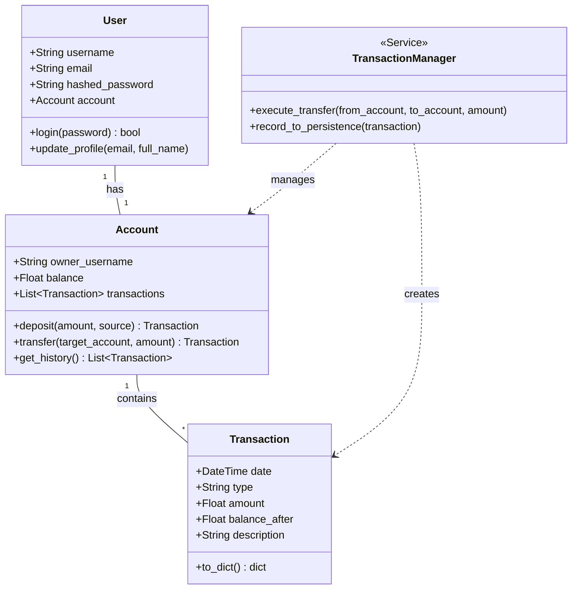

# Class Diagram & Design Decisions

This document outlines the Object-Oriented Programming (OOP) architecture for **Proggy Wallet** introduced in Phase 2. The transition from procedural scripts to a class-based structure aims to improve maintainability, scalability, and data integrity.

## Class Diagram

## Design Decisions

### 1. Decoupling User and Account
*   **Decision:** The `User` entity handles identity and authentication, while the `Account` entity manages financial state.
*   **Rationale:** This follows the **Single Responsibility Principle (SRP)**. A user represents a person, whereas an account represents a financial container. This separation allows a single user to potentially own multiple accounts (e.g., Savings, Checking) in future iterations without refactoring the core identity logic.

### 2. Encapsulated Logic in Account
*   **Decision:** Core financial operations like `deposit()` and `transfer()` are methods within the `Account` class.
*   **Rationale:** This ensures that the account "protects" its own state. The account is responsible for validating its balance before allowing a withdrawal or transfer, preventing invalid financial states at the object level.

### 3. Immutable Transaction Records
*   **Decision:** The `Transaction` class acts as a read-only snapshot of a financial event.
*   **Rationale:** In financial systems, audit trails must be immutable. Once a transaction is created, it should never be modified. This ensures the integrity of the transaction history and simplifies balance reconciliation.

### 4. TransactionManager as a Service Layer
*   **Decision:** Introduced a `TransactionManager` to handle complex operations involving multiple entities.
*   **Rationale:** A transfer involves two different accounts. Placing this logic inside one of the accounts would create tight coupling. The `TransactionManager` acts as a coordinator (Service Pattern) that ensures the operation is atomic: if the deduction from the sender fails, the credit to the receiver never happens.

### 5. Type Safety with Pydantic (Integration)
*   **Decision:** All class attributes will be validated using Pydantic models before object instantiation.
*   **Rationale:** This provides a "fail-fast" mechanism. By enforcing strict types and constraints (e.g., `amount > 0`) at the entry point, we ensure that the logic within our classes always operates on clean, valid data.

### 6. Data Transfer Objects (DTO) Pattern
*   **Decision:** Split models into `Base`, `Create`, and `Final` versions (e.g., `UserBase`, `UserCreate`, `User`).
*   **Rationale:** Data takes different shapes depending on the application stage.
    *   **Base:** Contains common fields (e.g., `username`, `email`) to follow the **DRY (Don't Repeat Yourself)** principle.
    *   **Create:** Used only during registration/creation; it includes sensitive fields like `password` but lacks system-generated fields like `id` or `balance`.
    *   **Final/Out:** Used for responses and internal logic; it excludes sensitive data like passwords for security while including stateful data like `balance`.
    *   **Benefit:** This separation prevents critical security leaks, such as accidentally exposing password hashes through the API.
