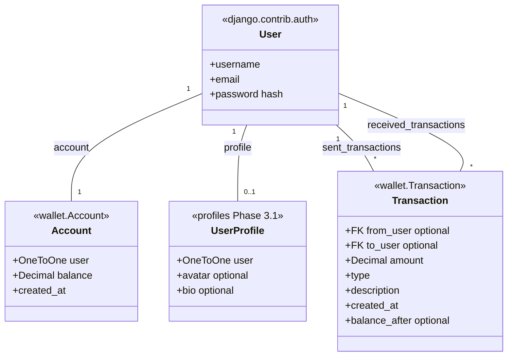

# Class Diagram & Design Decisions

This document describes the **domain-oriented** structure of Proggy Wallet aligned with the **Django** implementation (Phase 3) and the **planned** Phase 3.1 models. It complements [DATABASE.md](DATABASE.md) and `wallet/models.py`.

## Class diagram (conceptual / ORM-aligned)

```mermaid
classDiagram
    class User {
        <<django.contrib.auth>>
        +username
        +email
        +password hash
    }

    class UserProfile {
        <<profiles Phase 3.1>>
        +OneToOne user
        +avatar optional
        +bio optional
    }

    class Account {
        <<wallet.Account>>
        +OneToOne user
        +Decimal balance
        +created_at
    }

    class Transaction {
        <<wallet.Transaction>>
        +FK from_user optional
        +FK to_user optional
        +Decimal amount
        +type
        +description
        +created_at
        +balance_after optional
    }

    User "1" -- "1" Account : account
    User "1" -- "0..1" UserProfile : profile
    User "1" -- "*" Transaction : sent_transactions
    User "1" -- "*" Transaction : received_transactions
```

**Phase 3.1 (reports):** Aggregation and export logic may live in plain Python functions or a small **`reports.services`** module; it is not a second ledger. Diagrams can add `<<service>>` helpers later if useful.

## Design decisions

### 1. Decoupling User and Account

* **Decision:** Django `User` holds identity; `wallet.Account` holds the spendable balance (`OneToOne`).
* **Rationale:** Single responsibility. Matches the shipped ORM and migrations.

### 2. Transaction as ledger row

* **Decision:** `wallet.Transaction` records movements with optional `from_user` / `to_user` and positive `amount`.
* **Rationale:** Audit trail and history UI; constraints at DB and model level prevent invalid amounts.

### 3. UserProfile extension (Phase 3.1)

* **Decision:** Separate **`UserProfile`** model with **`OneToOneField`** to `User` for display fields and avatar.
* **Rationale:** Avoid overriding Django’s `User` table; keeps auth upgrades straightforward. Avatar storage follows [ADR-04](adr/04-user-avatar-storage-local-vs-object-storage.md).

### 4. Validation in Django, not a parallel API layer

* **Decision:** Incoming data is validated with **Django Forms** and **model validators** / `CheckConstraint`.
* **Rationale:** The product is a server-rendered Django app; one validation path reduces drift.

### 5. Reports read the wallet schema

* **Decision:** First version of **`reports`** performs **read-only** ORM queries over `Transaction` (and `Account` if needed for context).
* **Rationale:** One source of truth for money; reporting cannot bypass wallet invariants.

---

*Last updated: 23 March, 2026 — Django / Phase 3 + planned `UserProfile`.*
