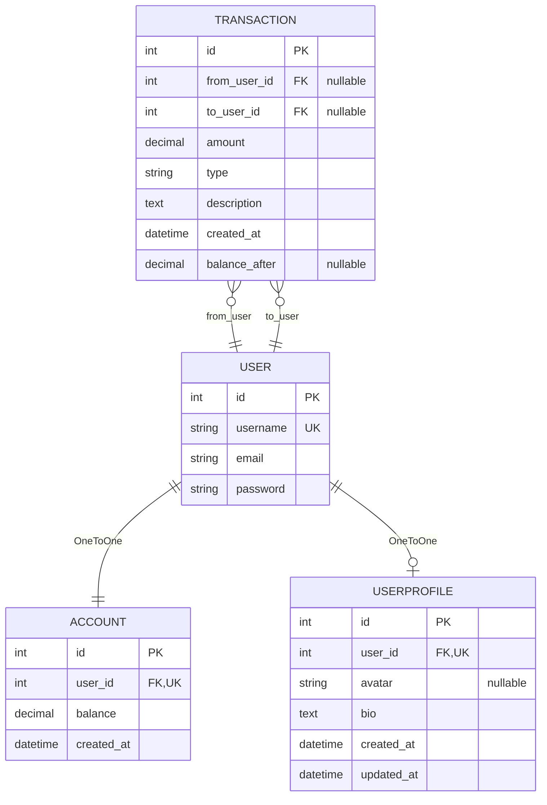

# Database Design

This document serves as one of the three documents that makes up the single source of truth of this project, along with [ARCHITECTURE.md](ARCHITECTURE.md) and [PRD.md](PRD.md). Here its defined the *database* schema of the project, *where* and *how* the data is stored and how the entities interact with each other to accomplish the business logic defined in the PRD.

The **implemented** schema includes **Phase 3** (Django ORM): Django’s built-in user table plus `wallet_account` and `wallet_transaction` (see `wallet/models.py` and migrations), and **Phase 3.1** table **`profiles_userprofile`** for model **`UserProfile`** (see `profiles/models.py` and migrations).

The **`reports`** app adds **no tables** in v1 (read-only queries over `wallet`).

## Entity Relationship Diagram (ERD)

> **Note:** `USERPROFILE` is **implemented** in `profiles`; the canonical column list is `profiles/models.py` and migrations. **`reports`** adds **no new tables** (read-only over `wallet`).

## Data Model Explanation

The design separates **identity** (Django `User`), **current funds** (`Account`), and the **ledger** (`Transaction`). Financial rules are enforced with ORM validators and PostgreSQL `CHECK` constraints (via Django `CheckConstraint`).

### Entities and Relationships

#### 1. User (`django.contrib.auth.models.User`)

Standard Django authentication user. Holds username, email, password hash, and related auth fields. **Balance is not stored on `User`.**

#### 2. Account (`wallet.Account`)

One row per user wallet balance.

- **user**: `OneToOneField` to `User` (`related_name='account'`). Cascade delete removes the account with the user.
- **balance**: `DecimalField(max_digits=12, decimal_places=2)`, default `0.00`, with `MinValueValidator(0)` and DB check **`balance >= 0`** (`balance_non_negative`).
- **created_at**: Set automatically on create.

**Provisioning:** A `post_save` signal on `User` calls `Account.objects.get_or_create(user=instance)` when a user is created, so new users always get an `Account`.

#### 3. Transaction (`wallet.Transaction`)

Append-only style ledger for deposits and transfers (and reserved type `withdrawal` in choices).

- **from_user** / **to_user**: Optional `ForeignKey` to `User` (`SET_NULL` on delete), `related_name='sent_transactions'` / `'received_transactions'`. Deposits set `to_user` only; transfers set both.
- **amount**: `DecimalField` with `MinValueValidator(0.01)` and DB check **`amount > 0`** (`amount_positive`).
- **type**: `CharField` with choices `deposit`, `transfer`, `withdrawal`.
- **description**: Optional text (e.g. transfer memo).
- **created_at**: Automatic timestamp.
- **balance_after**: Optional; after deposits/transfers from the web UI it stores the **sender’s** account balance after the operation where applicable.

#### 4. UserProfile (`profiles.UserProfile`) — Phase 3.1 (implemented)

- **user**: `OneToOneField` to `User` (`related_name='profile'`). Cascade delete removes the profile with the user.
- **bio**: `TextField`, optional (blank allowed), max length 500 at model level.
- **avatar**: Optional `ImageField` (`upload_to='avatars/'`); file storage per [ADR-04](adr/04-user-avatar-storage-local-vs-object-storage.md).
- **created_at** / **updated_at**: Automatic timestamps (`auto_now_add` / `auto_now`).

### Key Design Principles

- **Separation of concerns**: Balances live on `Account`; `Transaction` rows provide history and audit context.
- **Integrity**: Non-negative balance and strictly positive amounts are enforced at validation and database level.
- **Evolution**: Optional FKs and `withdrawal` allow future flows without breaking existing rows.

---

*Last updated: 30 March, 2026 — Phase 3.1 `UserProfile` implemented; `reports` remains table-free.*
