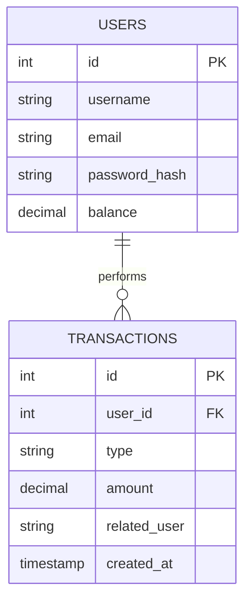

# Database Design

This document outlines the relational database schema for the Proggy Wallet application.

## Entity Relationship Diagram (ERD)

## Data Model Explanation

The current design follows a simplified relational model focused on financial integrity and traceability, perfectly suited for the Phase 2 requirements.

### Entities and Relationships

#### 1. USERS Entity
This is the core of the wallet system. It contains the user's identification data and the current total funds available to the user.
- **id (PK)**: Unique identifier for each user.
- **username / email**: Identification data, marked as `UNIQUE` to prevent duplicates.
- **password_hash**: Stores encrypted passwords (never plain text) for security.
- **balance**: The current total funds available to the user.

#### 2. TRANSACTIONS Entity
Records every movement of money.
- **id (PK)**: Unique identifier for the transaction.
- **user_id (FK)**: Links the transaction to a specific user.
- **type**: Categorizes the movement (e.g., `deposit`, `transfer`).
- **amount**: The monetary value of the transaction. Uses `decimal` types to ensure precision and avoid floating-point errors.
- **related_user**: Stores the counterpart's name for transfers, providing quick context without complex joins.
- **created_at**: Automatic timestamp for audit trails.

### Key Design Principles

- **One-to-Many Relationship (`||--o{`)**: A single user can have multiple transactions, but each transaction belongs to exactly one user.
- **Data Integrity**: The schema includes database-level constraints (e.g., `balance >= 0` and `amount > 0`) to enforce business rules at the storage layer.
- **Scalability**: While simple, this two-table structure provides a solid foundation for future features like categories or contact lists.

*Last Updated: 16 February, 2026 - Phase 2 - Sprint 16: Database Design & Setup*