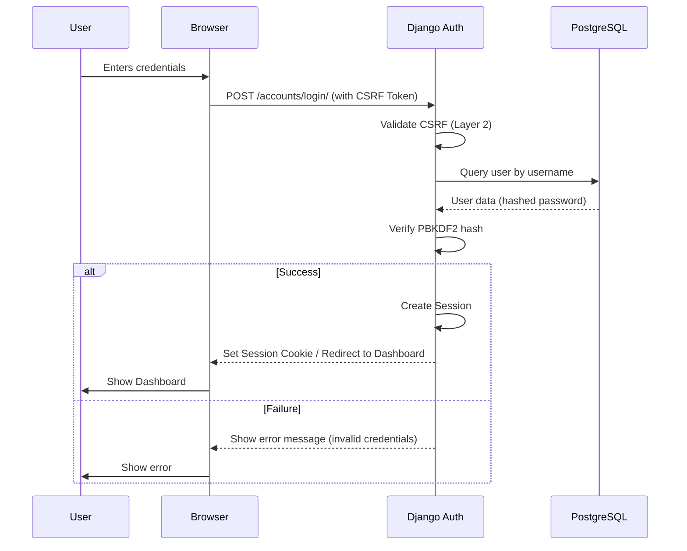
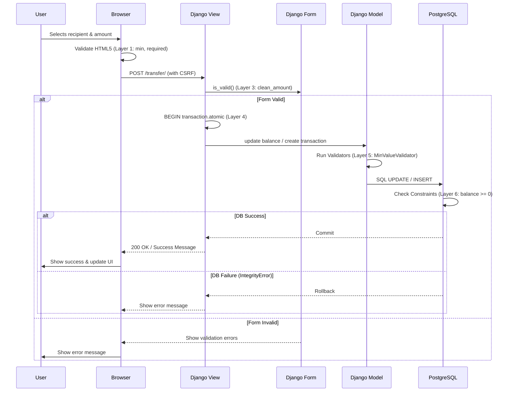

# System Flows (Phase 3)

This document contains the visual representation of the main business processes in the Django-based architecture using Mermaid sequence diagrams.

## 1. User Authentication Flow (Session-Based)

## 2. Peer-to-Peer Transfer Flow (Layered Integrity)

---

*Last updated: 11 March, 2026 - Phase 3 - Sprint 26: Cleanup and Local Deployment*
