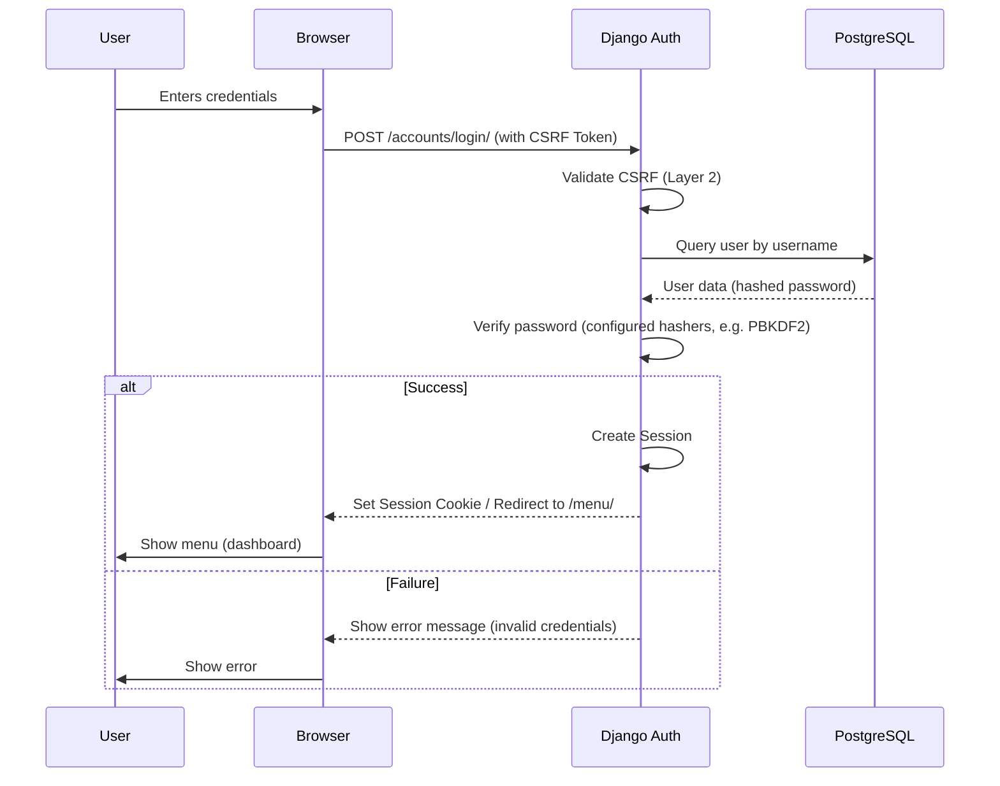
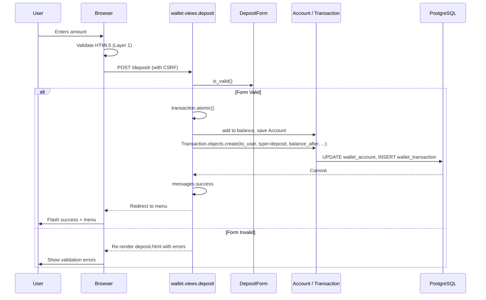
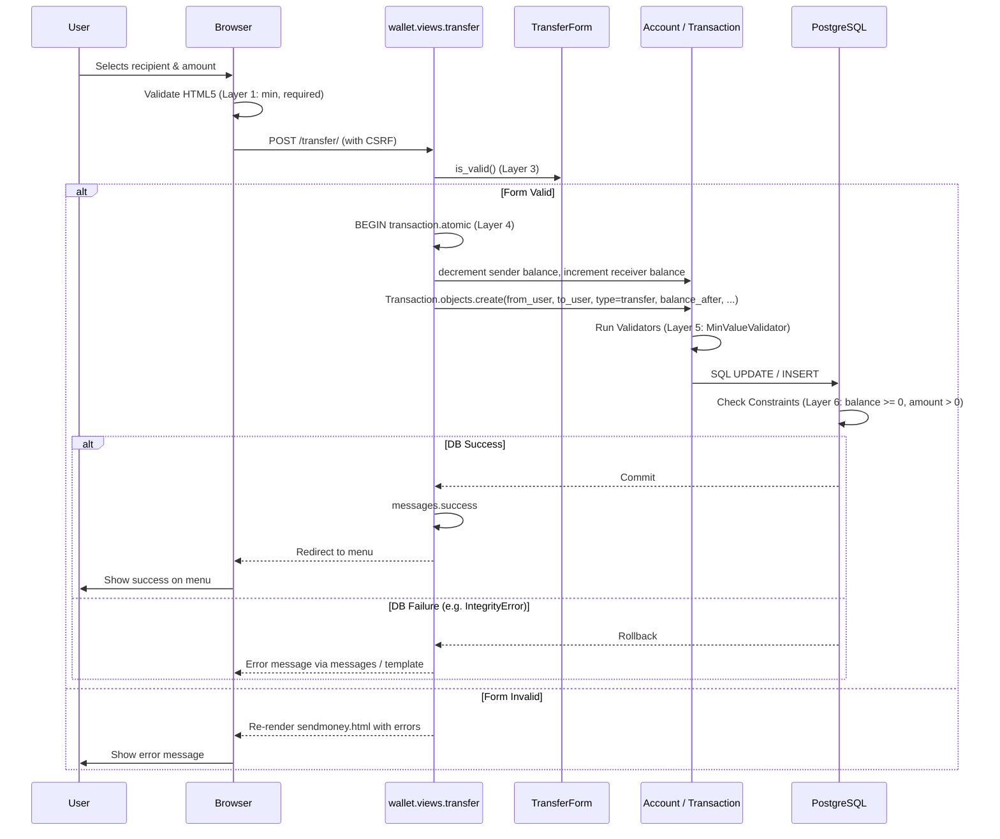
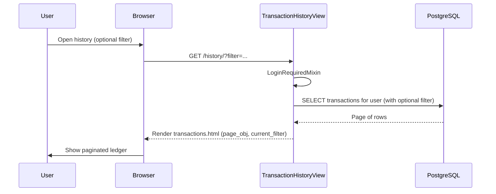

# System Flows (Phase 3)

This document contains the visual representation of the main business processes in the Django-based architecture using Mermaid sequence diagrams. Paths match `config/urls.py` and behaviour in `wallet/views.py`.

## 1. User Authentication Flow (Session-Based)

Login uses Django’s built-in views under `/accounts/` (e.g. `POST /accounts/login/`). On success, `LOGIN_REDIRECT_URL` sends the user to the named route **`menu`** (`/menu/`).

## 2. Deposit Flow

## 3. Peer-to-Peer Transfer Flow (Layered Integrity)

Template: `wallet/sendmoney.html`. URL path: **`/transfer/`**.

## 4. Transaction History Flow

`TransactionHistoryView`: `GET /history/` (optional query `?filter=income` or `?filter=expense`). Queryset: transactions where the user is `from_user` OR `to_user`, ordered by `-created_at`, paginated (`paginate_by = 10`).

## 5. Root URL

`GET /` triggers a redirect to the named route **`menu`** (`/menu/`), implemented in `config/urls.py`.

---

*Last updated: 23 March, 2026 — Phase 3; aligned with `config/urls.py` and `wallet/views.py`.*
