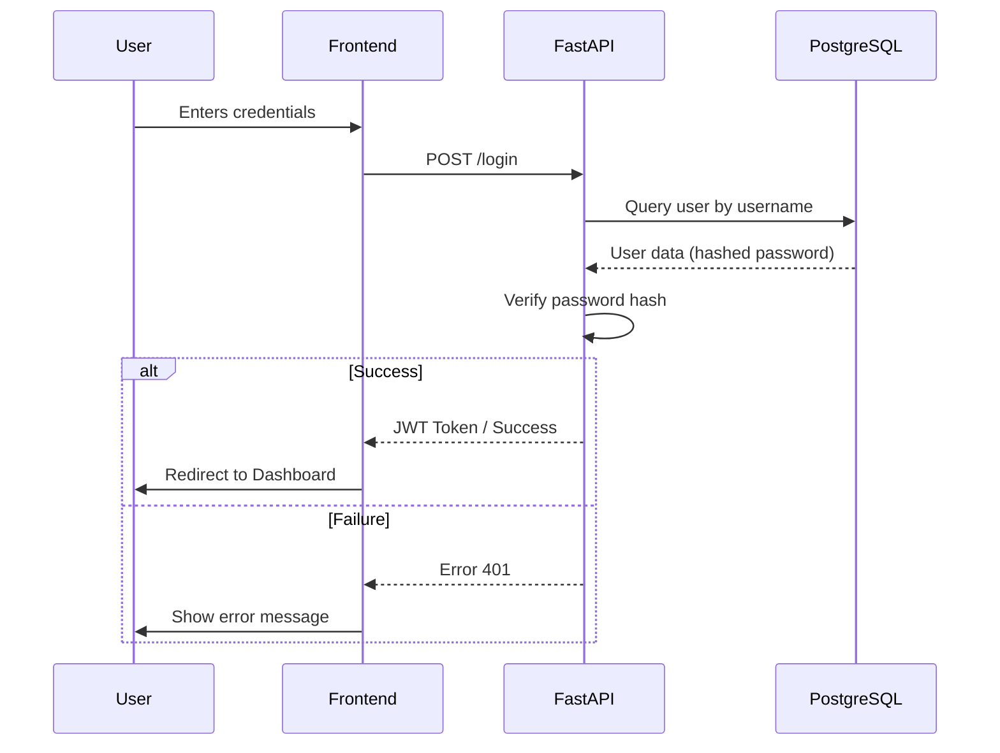
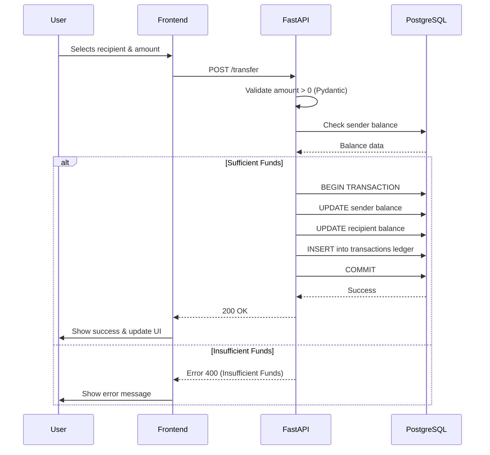

# System Flows

This document contains the visual representation of the main business processes using Mermaid sequence diagrams.

## 1. User Authentication Flow

## 2. Peer-to-Peer Transfer Flow

---

*Last updated: 16 February, 2026 - Phase 2 - Sprint 16: Database Design & Setup*