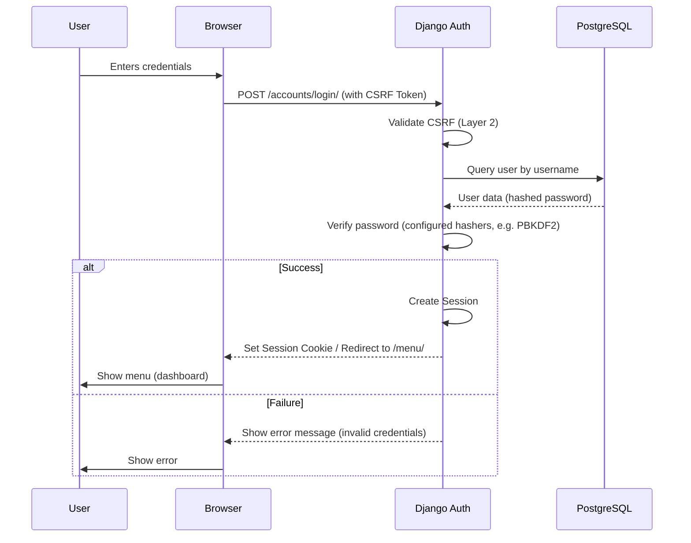
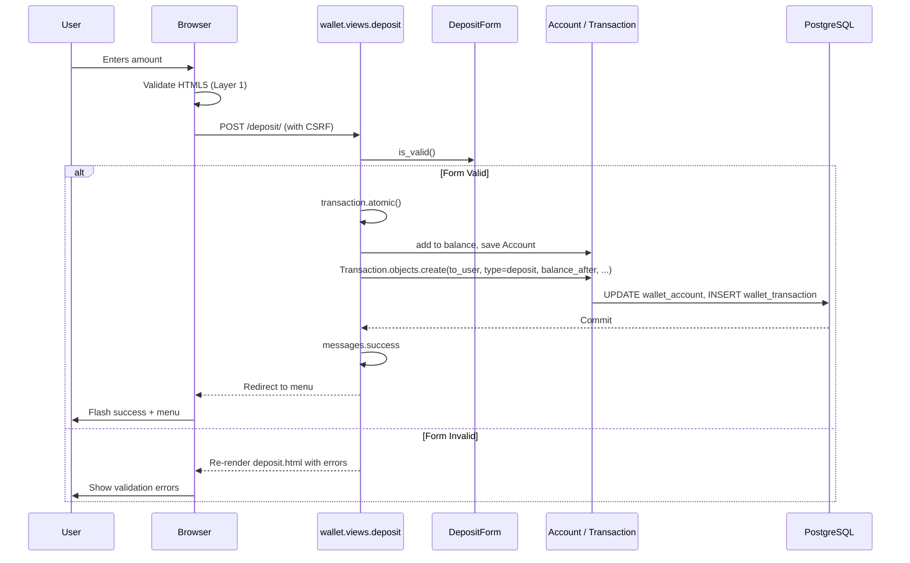
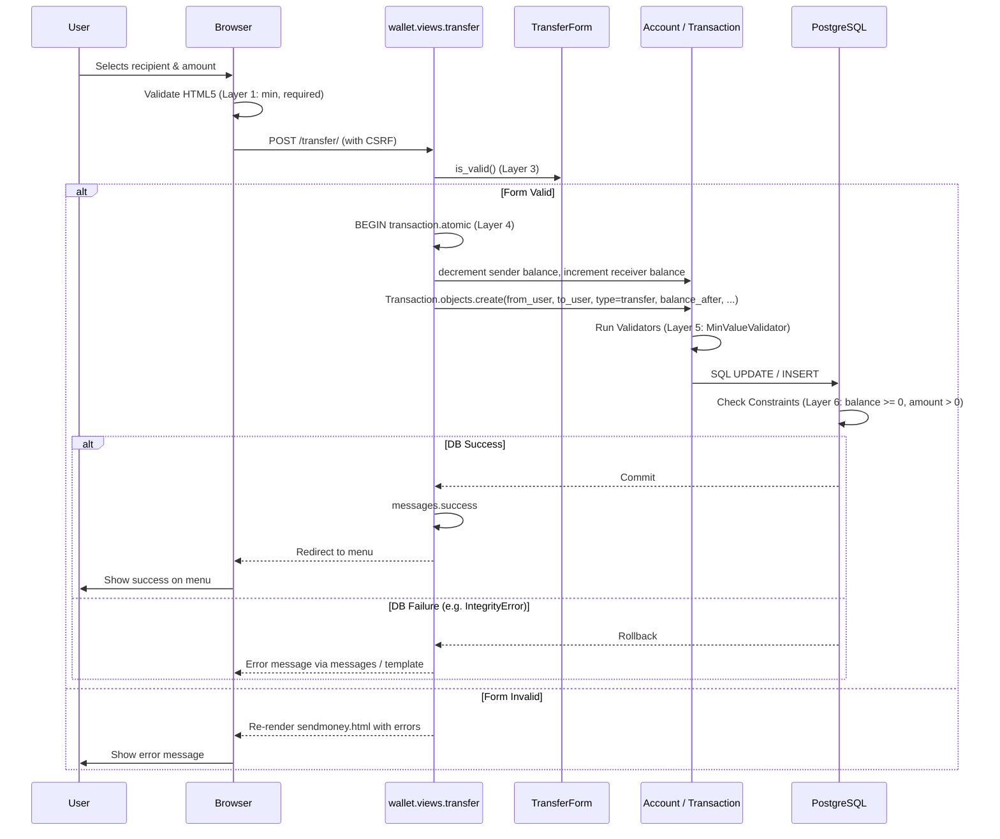
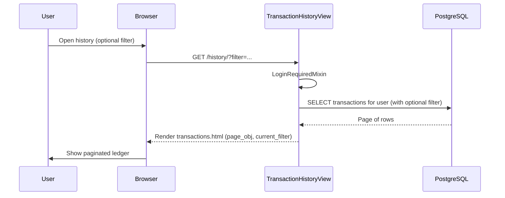
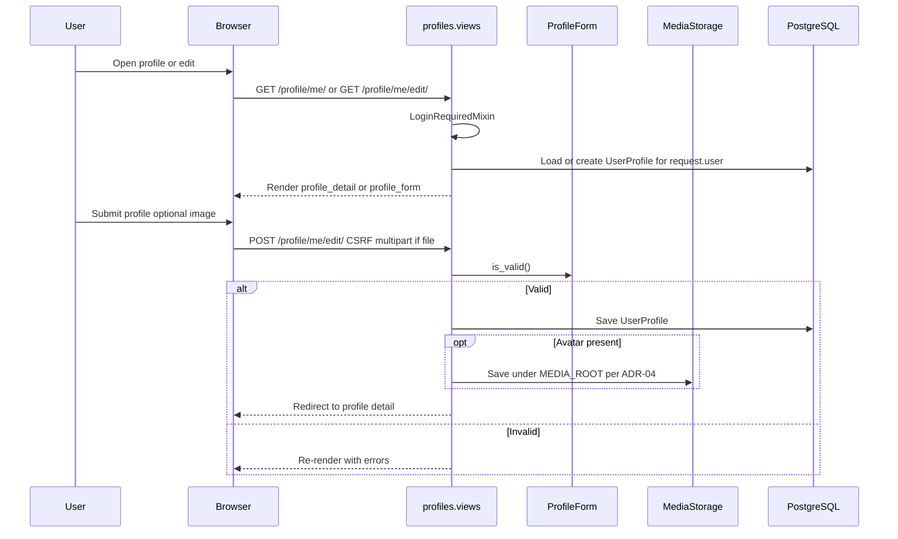
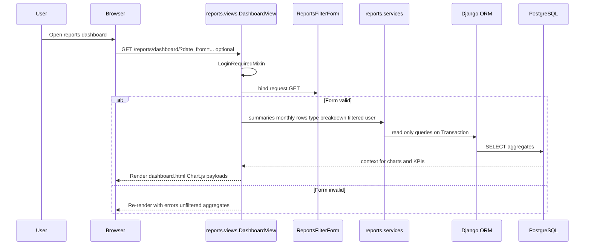
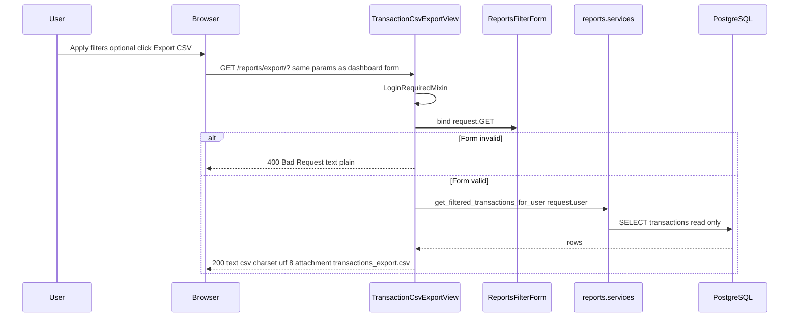

# System Flows (Phase 3)

This document contains the visual representation of the main business processes in the Django-based architecture using Mermaid sequence diagrams. Paths match `config/urls.py` and behaviour in `wallet/views.py`.

## 1. User Authentication Flow (Session-Based)

Login uses Django’s built-in views under `/accounts/` (e.g. `POST /accounts/login/`). On success, `LOGIN_REDIRECT_URL` sends the user to the named route **`menu`** (`/menu/`).

## 2. Deposit Flow

## 3. Peer-to-Peer Transfer Flow (Layered Integrity)

Template: `wallet/sendmoney.html`. URL path: **`/transfer/`**.

## 4. Transaction History Flow

`TransactionHistoryView`: `GET /history/` (optional query `?filter=income` or `?filter=expense`). Queryset: transactions where the user is `from_user` OR `to_user`, ordered by `-created_at`, paginated (`paginate_by = 10`).

From **My Movements**, the user may open **Reports** via a link to `GET /reports/dashboard/` (named route `reports:dashboard`).

## 5. Root URL

`GET /` triggers a redirect to the named route **`menu`** (`/menu/`), implemented in `config/urls.py`.

---

## 6. Phase 3.1 flows — `profiles` and `reports` (implemented)

Paths match [MODULES.md](MODULES.md) and `config/urls.py`.

### 6.1 View / edit profile and avatar

### 6.2 Reports dashboard (read-only)

### 6.3 CSV export (user-scoped)

Same filter contract as the dashboard: query params `date_from`, `date_to`, `filter` (income or expense), `tx_type`. Invalid date range returns **400** with form errors (no CSV body). Empty result set returns **200** with header row only. Anonymous users are redirected to login.

The dashboard **Export CSV** button submits the filter form with `formaction` pointing to `reports:export` so current field values are sent as GET parameters.

---

*Last updated: 30 March, 2026 — Phase 3.1 flows implemented (profiles, reports, CSV).*
