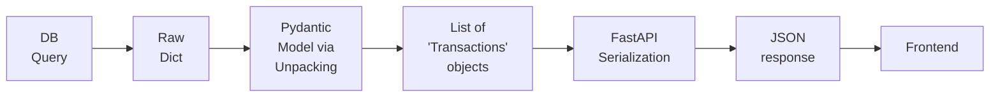

# DEVLOG

This document outlines the development process of the `proggy-wallet` project. It is a record of the decisions made, the learnings gained, and the progress made.
It is a living document that will be updated as the project evolves.

## 📑 Index

### 🏗️ Phase 3: Enterprise Ecosystem (Django)
- [[2026-03-25] - Sprint: User Profiles Infrastructure & Management](#2026-03-25---sprint-user-profiles-infrastructure--management)
- [[2026-03-23] - Sprint 26: Documentation alignment and Phase 3.1 planning](#2026-03-23---sprint-26-documentation-alignment-and-phase-31-planning)
- [[2026-03-11] - Sprint 25.5: Full-Layered Security and Integrity Implementation](#2026-03-11---sprint-255-full-layered-security-and-integrity-implementation)
- [[2026-03-11] - Review: Data Integrity Layers in Django](#2026-03-11---review-data-integrity-layers-in-django)
- [[2026-03-09] - Review: Service Layer Evolution & Django ORM Integration](#2026-03-09---review-service-layer-evolution--django-orm-integration)
- [[2026-03-09] - Sprint 25: Business Logic & Advanced History Features](#2026-03-09---sprint-25-business-logic--advanced-history-features)
- [[2026-03-06] - Sprint 23 & 24: Authentication System, View and Template Migration](#2026-03-06---sprint-23--24-authentication-system-view-and-template-migration)
- [[2026-03-05] - Sprint 22: Django Model Definition and ORM Migration](#2026-03-05---sprint-22-django-model-definition-and-orm-migration)
- [[2026-03-04] - Sprint 21: Django 6 Migration and Initialization](#2026-03-04---sprint-21-django-6-migration-and-initialization)
- [[2026-03-04] - Review: Phase 2 Recap - Architectural Evolution](#2026-03-04---review-phase-2-recap---architectural-evolution)

### 🚀 Phase 2: Professionalization & Database integration
<details>
  <summary>Click to view Phase 2 Sprints (Feb 2026)</summary>
  
- [[2026-02-26] - Phase 2: System Integration & API Refactoring (Sprint 20)](#2026-02-26---phase-2-system-integration--api-refactoring-sprint-20)
- [[2026-02-26] - Review: Model Hydration and API Serialization Flow](#2026-02-26---review-model-hydration-and-api-serialization-flow)
- [[2026-02-25] - Phase 2: Architectural Refactoring and SQL Integration (Sprint 19)](#2026-02-25---phase-2-architectural-refactoring-and-sql-integration-sprint-19)
- [[2026-02-24] - Phase 2: Testing Infrastructure and Core Logic (Sprint 19)](#2026-02-24---phase-2-testing-infrastructure-and-core-logic-sprint-19)
- [[2026-02-18] - Phase 2: Data Access Layer - Writing (Sprint 18)](#2026-02-18---phase-2-data-access-layer---writing-sprint-18)
- [[2026-02-18] - Deep Dive: Database integration debugging session (Sprint 18)](#2026-02-18---deep-dive-database-integration-debugging-session-sprint-18)
- [[2026-02-18] - Phase 2: Data Access Layer - Reading (Sprint 17)](#2026-02-18---phase-2-data-access-layer---reading-sprint-17)
- [[2026-02-16] - Phase 2: Database Design & Setup (Sprint 16)](#2026-02-16---phase-2-database-design--setup-sprint-16)
- [[2026-02-16] - Review: Domain-Driven Design (DDD) Principles](#2026-02-16---review-domain-driven-design-ddd-principles)
- [[2026-02-13] - Documentation: Project professionalization](#2026-02-13---documentation-project-professionalization)
- [[2026-02-12] - Phase 2: Transaction engine & service layer (Sprint 15)](#2026-02-12---phase-2-transaction-engine--service-layer-sprint-15)
- [[2026-02-12] - Review: Software Atomicity & Manual Rollbacks](#2026-02-12---review-software-atomicity--manual-rollbacks)
- [[2026-02-11] - Phase 2: Core entities & security layer (Sprint 14)](#2026-02-11---phase-2-core-entities--security-layer-sprint-14)
- [[2026-02-10] - Phase 2: Initiation & data modeling (sprint 13)](#2026-02-10---phase-2-initiation--data-modeling-sprint-13)
- [[2026-02-10] - Review: Data Integrity with DTOs & Pydantic](#2026-02-10---review-data-integrity-with-dtos--pydantic)
</details>

### 🏗️ Phase 1: MVP & Foundations
<details>
  <summary>Click to view Phase 1 Sprints (Jan 2026)</summary>

- [[2026-01-31] - Phase 1: Wallet testing & project finalization](#2026-01-31---phase-1-wallet-testing--project-finalization)
- [[2026-01-30] - Phase 1: Quality assurance & unit testing (part 1)](#2026-01-30---phase-1-quality-assurance--unit-testing-part-1)
- [[2026-01-27] - Phase 1: Full-stack integration with FastAPI](#2026-01-27---phase-1-full-stack-integration-with-fastapi)
- [[2026-01-26] - Phase 1: Transaction history view](#2026-01-26---phase-1-transaction-history-view)
- [[2026-01-25] - Phase 1: Wallet operations (deposits & transfers)](#2026-01-25---phase-1-wallet-operations-deposits--transfers)
- [[2026-01-24] - Phase 1: Dashboard menu implementation](#2026-01-24---phase-1-dashboard-menu-implementation)
- [[2026-01-23] - Phase 1: Frontend foundations & login implementation](#2026-01-23---phase-1-frontend-foundations--login-implementation)
- [[2026-01-21] - Phase 1: Create main script and integrate modules](#2026-01-21---phase-1-create-main-script-and-integrate-modules)
- [[2026-01-18] - Phase 1: Wallet transactions module completed](#2026-01-18---phase-1-wallet-transactions-module-completed)
- [[2026-01-17] - Phase 1: Base utils & authentication modules](#2026-01-17---phase-1-base-utils--authentication-modules)
- [[2026-01-16] - Phase 1: Initial project setup & tooling](#2026-01-16---phase-1-initial-project-setup--tooling)
</details>

---

## [2026-03-25] - Sprint: User Profiles Infrastructure & Management

### Context & Goals
The primary goal was to establish a robust user profile system, allowing users to manage their personal information and identity within the application. This involved creating the underlying data structures, handling media storage for avatars, and implementing the necessary views and forms for profile management.

### Technical Implementation
- **App Creation:** Initialized the `profiles` Django application to decouple user metadata from the core authentication logic.
- **Data Modeling:** Implemented the `UserProfile` model with a `OneToOne` relationship to Django's `User` model, including `bio`, `avatar`, and audit fields (`created_at`, `updated_at`).
- **Media Handling:** Configured `MEDIA_URL` and `MEDIA_ROOT` for local development and enabled media serving in `urls.py`.
- **Form Logic & Validation:** Created `ProfileForm` with custom image validation (2MB limit and format checks) and integrated `first_name`/`last_name` fields from the `User` model.
- **Views & Templates:** 
    - Implemented `ProfileDetailView` and `ProfileUpdateView` using Django's Class-Based Views.
    - Developed responsive templates using **Bootstrap 5**, including multipart form support for image uploads.
- **Global Integration:** Integrated the user avatar and profile links into the global navigation bar (`base.html`).
- **Quality Assurance:** Added a suite of automated tests (`ProfileTests`) covering authorization, auto-creation of profiles, and image validation logic.

### 💡 Deep Dive: One-to-One Model Signals vs. Lazy Creation
During this sprint, I focused on ensuring every user has a profile. Instead of relying solely on post-save signals (which can sometimes be brittle during bulk operations), I implemented a pattern in the `ProfileDetailView` to ensure a `UserProfile` is auto-created on first access if it doesn't exist. This guarantees data integrity when navigating the UI while keeping the `User` model lean.

### Next Steps
- Implement password change and account settings functionality.
- Migrate local media storage to an S3-compatible object storage (as per ADR-04).
- Optional: Add frontend cropping functionality for avatars to improve UX.

---

## [2026-03-23] - Sprint 26: Documentation alignment and Phase 3.1 planning

### Context & Goals
Now that the Phase 3 wallet functionality is in place, the **canonical docs** (`PRD`, `ARCHITECTURE`, `DATABASE`, `MODULES`, `FLOWS`, `CLASS_DIAGRAM`, `ROADMAP`) had drifted from the Django-only reality and did not yet describe the next product increment. 

I decided to update  the documentation on **Django + PostgreSQL** (no FastAPI in the shipping product narrative), **recording** the historical FastAPI choice as superseded in **ADR-01**, and **locking in a concrete plan** for **Phase 3.1** (`profiles` with `UserProfile`, `reports`/insights) before the **Phase 4** implementation (deployment and CI/CD) plus a **Phase 5** backlog for post-MVP ideas.

### Technical Implementation
*   **`docs/ROADMAP.md`:** 
     - Removed FastAPI/Pydantic from the forward-looking tech table. 
     - Rewrote Phase 2 in generic OOP/PostgreSQL terms. 
     - Added **Phase 3.1** (deliverables checklist for `profiles` and `reports`, `MEDIA_*`, CSV export intent) and **Phase 5** (future apps: preferences, notifications, support, budgets, etc.). 
     - Kept **Phase 4** as CI/CD and cloud, with a pointer to avatar/media strategy for production.
*   **`docs/PRD.md` & `docs/ARCHITECTURE.md`:** 
     - Reframed the product around **Django MVT**, session-based flows, and planned apps. 
     - Replaced the old FastAPI/service/repository stack diagram with a Django-oriented layer description. 
     - Updated the ADR index to include **ADR-04** and mark **ADR-01** as **Superseded**.
*   **`docs/DATABASE.md`:** 
     - Extended the ERD with planned **`UserProfile`** (`OneToOne` to `User`).
     - Documented that **`reports` v1** is expected to add **no new tables** (read-only over `wallet`).
*   **`docs/MODULES.md` & `docs/FLOWS.md`:** 
     - Added planned folder layout for `profiles/` and `reports/`. 
     - Added dependency table (`reports` read-only on `wallet`). 
     - Added illustrative future URL prefixes. 
     - Added Mermaid flows for profile/avatar, insights, and CSV export.
*   **`docs/CLASS_DIAGRAM.md`:** 
     - Replaced Phase-2/Pydantic-centric narrative with **ORM-aligned** classes including planned **`UserProfile`**.
*   **`docs/adr/04-user-avatar-storage-local-vs-object-storage.md`:** 
     - New ADR — **local `MEDIA_ROOT` in development** vs **object storage or persistent volumes in production** to avoid silent file loss on ephemeral PaaS filesystems during Phase 4.

### 💡 Deep Dive: Documentation as contract for the next slice of work
Treating **docs as the contract** for Phase 3.1 reduces thrash when implementing `profiles` and `reports`: the **dependency rule** (reports never writes a parallel ledger) and **ADR-04** (where avatar bytes live per environment) are decided *before* the implementation, so settings and deployment checklists in Phase 4 stay traceable. Superseding **ADR-01** instead of deleting it preserves audit history while making the **current** stack unambiguous for readers.

### Next Steps
*   **Implement Phase 3.1:** Scaffold `profiles` (`UserProfile`, forms, templates, `MEDIA_URL` / `MEDIA_ROOT` in dev) and `reports` (aggregations, UI, user-scoped CSV export); register apps in `config/settings.py` and include URLconfs.
*   **Phase 4:** `Dockerfile`, enhance the `docker-compose`, GitHub Actions (Ruff + Pytest), then cloud deploy with **media** configuration aligned to **ADR-04**.
*   **Optional:** Pull items from **Phase 5** in `ROADMAP.md` into future sprints when scope is frozen per feature.

---

## [2026-03-11] - Sprint 25.5: Full-Layered Security and Integrity Implementation

### Context & Goals
The objective of this sprint (`phase3-05b`) was to reinforce the financial security of **Proggy Wallet** by implementing a "Defense in Depth" strategy. While previous sprints handled form and view-level logic, this task focused on the most critical layers: the Frontend UX (Layer 1), Model Validation (Layer 5), and Database Integrity (Layer 6), ensuring that the system remains robust even after the legacy code cleanup.

### Technical Implementation
*   **Layer 6 (Database Constraints):** Added `CheckConstraint` in `wallet/models.py` for both `Account` (balance >= 0) and `Transaction` (amount > 0). This ensures that PostgreSQL physically rejects any invalid financial state at the engine level.
*   **Layer 5 (Model Validation):** Implemented `MinValueValidator` on `balance` and `amount` fields. This provides a Python-level shield that triggers during `full_clean()` or within the Django Admin/Shell.
*   **Layer 1 (Frontend UX):** Updated `templates/deposit.html` and `templates/sendmoney.html` to include native HTML5 attributes (`min="0.01"`, `step="0.01"`, `required`) for immediate user feedback.
*   **Automated Testing:** Developed a comprehensive suite in `wallet/tests.py` using `assertRaises` to verify that both `ValidationError` (Python) and `IntegrityError` (SQL) are correctly triggered when rules are violated.
*   **Environment Configuration:** Updated `pyproject.toml` to include `DJANGO_SETTINGS_MODULE`, allowing `pytest` to run seamlessly within the Django environment.

### 💡 Deep Dive: Django Constraints vs. Validators
A key learning from this sprint is the distinction between **Validators** and **Constraints**. 
*   **Validators** (Layer 5) are "soft" checks; they are excellent for providing user-friendly error messages but can be bypassed if a developer uses methods like `.update()` or `.bulk_create()`. 
*   **Constraints** (Layer 6) are "hard" checks; they are enforced by the database itself. By combining both, we achieve a balance between a great User Experience (via validators) and absolute Data Integrity (via constraints).

### Next Steps
*   **Final Verification:** Perform a manual end-to-end test of the transfer flow to ensure flash messages are correctly displayed for balance errors.
*   **Sprint 26 (Cleanup):** Safely remove the legacy `backend/modules/` directory (FastAPI/Pydantic) now that the Django core is fully armored.
*   **Documentation:** Update the project's architecture diagram to reflect these new security layers.

---

## [2026-03-11] - Review: Data Integrity Layers in Django

### Context & Goals
While studying data integrity within the Django ecosystem, I identified several critical security layers. Before proceeding with the final cleanup (Sprint 26), I decided to implement an intermediate sprint (`phase3-05b`) to ensure a "defense-in-depth" strategy. This review documents the six layers of protection that will safeguard the **Proggy Wallet** financial data.

### Technical Implementation
*   **Layer 1: User Interface (Frontend/Browser):** Immediate feedback using HTML5 attributes (`type="number"`, `min="0"`) and JavaScript to prevent unnecessary server requests and improve UX.
*   **Layer 2: Transport & Protocol (Middleware/CSRF):** Django's built-in `CsrfViewMiddleware` and `AuthenticationMiddleware` verify request identity and protect against CSRF attacks.
*   **Layer 3: Input Validation (Django Forms):** Server-side data sanitization using `forms.DecimalField(min_value=0)` and custom `clean_amount()` methods.
*   **Layer 4: Business Logic (Views/Services):** Orchestration of atomic operations using `transaction.atomic()` to ensure "all-or-nothing" execution for financial movements.
*   **Layer 5: Model Integrity (Django ORM):** Using Django's `validators=[MinValueValidator(0)]` on model fields to catch invalid data entry via the ORM, Admin, or Shell.
*   **Layer 6: Database Integrity (Constraints):** The "Golden Rule" enforced directly by PostgreSQL via `CheckConstraint` (e.g., `balance >= 0`). This is the final line of defense against any logic bypass.

### 💡 Deep Dive: Defense in Depth
The concept of **Defense in Depth** is vital for financial applications. By implementing multiple overlapping security layers, we ensure that the failure of one layer (e.g., a bug in the view logic) is caught by a subsequent one (e.g., the database constraint). 

In this sprint, the addition of **Layer 5 (Model Validators)** and **Layer 6 (DB Constraints)** provides a robust shield that persists when the legacy Phase 2 code is removed. This allows us to perform the cleanup in Sprint 26 with absolute confidence that the system's invariants remain protected at the lowest possible level.

### Next Steps
*   **Sprint 25.5 Execution:** Implement the `CheckConstraint` and `MinValueValidator` in `wallet/models.py`.
*   **Frontend Update:** Ensure all templates use native HTML5 validation attributes.
*   **Sprint 26 (Cleanup):** Remove legacy `backend/modules/` once the new multi-layered security is verified.

---

## [2026-03-09] - Review: Service Layer Evolution & Django ORM Integration

### Context & Goals
The objective of this review is to analyze how the **Service Layer** and **Domain-Driven Design (DDD)** principles established during Phase 2 have evolved with the migration to Django. I also detail how the **Django ORM** has replaced manual SQL and Pydantic repositories to handle financial logic more efficiently.

### Technical Implementation
*   **Encapsulation Shift:** In Phase 2, I used `entities.py` to protect business invariants. In Phase 3, these rules are encapsulated within Django's `models.py` and `forms.py` (using `clean()` methods).
*   **Orchestration & Atomicity:** The manual `TransactionManager` from Phase 2 has been replaced by Django's `transaction.atomic()` blocks within `views.py`. This ensures "all-or-nothing" execution for transfers.
*   **ORM as a Repository:** I transitioned from raw SQL (`SELECT`, `INSERT`) to Django's Querysets. The ORM now handles complex joins and filtering in the `TransactionHistoryView` using `Q` objects:
    ```python
    # Example of ORM usage in history view
    queryset = Transaction.objects.filter(
        Q(from_user=self.request.user) | Q(to_user=self.request.user)
    ).order_by('-created_at')
    ```
*   **Data Integrity:** The `balance_after` field persists as a core part of the `Transaction` model, populated immediately after balance updates via the ORM's `.save()` method to guarantee a consistent audit trail.

### 💡 Deep Dive: The "Service Layer" in a Framework World
In my Phase 2 stack (FastAPI), a manual **Service Layer** was mandatory because the framework was "unopinionated". I had to build my own "glue" to connect Pydantic models, SQL repositories, and business entities.

In **Django**, the framework provides a "High-Level" abstraction through its **ORM**. This tool has been pivotal in Phase 3 for:
1.  **Model Definition:** Replacing `.sql` schema files with Python classes.
2.  **Relationship Management:** Using `ForeignKey` and `OneToOneField` to handle data links automatically.
3.  **Safe Writes:** Generating optimized `UPDATE` and `INSERT` statements while preventing SQL injection.

Even with these "batteries", the **Service Layer pattern** remains relevant. As the **Proggy Wallet** grows, I could re-introduce an explicit `services.py` to prevent "Fat Views" and keep orchestration logic decoupled from HTTP concerns.

### Next Steps
*   **Documentation Sync:** Update `docs/DATABASE.md` and `docs/CLASS_DIAGRAM.md` to reflect the current Django model relationships (e.g., `OneToOneField` for `Account`).
*   **Refactoring:** Evaluate moving the `transfer` and `deposit` orchestration logic from `views.py` to a dedicated `services.py` if additional side-effects are added.
*   **Cleanup:** Proceed with the scheduled removal of legacy `backend/` modules (FastAPI/Pydantic) in the next sprint.

---


## [2026-03-09] - Sprint 25: Business Logic & Advanced History Features

### Context & Goals
In today's session the goal was to finalize the core financial logic for the `wallet` application (Phase 3 - `phase3-05`). I focused on enhancing the transaction history with advanced filtering (Incomes/Expenses), implementing robust pagination, and refactoring the codebase from procedural functions to Django's Class-Based Views (CBV) for better scalability and maintainability.

### Technical Implementation
*   **Model Enhancement:** Added `balance_after` field to the `Transaction` model to persist a "snapshot" of the user's balance at the moment of the transaction, ensuring an accurate and immutable audit trail.
*   **Business Logic Update:** Refactored `deposit` and `transfer` views in `wallet/views.py` to populate the `balance_after` field immediately after successful balance updates within `transaction.atomic()` blocks.
*   **Frontend Interactivity:** Updated `templates/transactions.html` to replace static buttons with dynamic filter links (`?filter=income/expense`) and implemented a responsive pagination UI using Bootstrap 5.
*   **View Refactoring:** Transitioned the `history` view from a Function-Based View (FBV) to a `ListView` (CBV) to leverage Django's built-in pagination engine.
*   **URL Routing:** Updated `core/urls.py` to handle the new class-based structure using the `.as_view()` method.

### 💡 Deep Dive: FBV vs. CBV and the `.as_view()` function
In this sprint, while implementing the pagination in the 'My Movements' view, I first implemented it using a  **Function-Based Views (FBV)** approach, and then refactored it to use a **Class-Based Views (CBV)** approach using the `ListView` class. The approach was different but the result was the same.

**Key Differences in Pagination:**
*   **In FBVs:** To make the pagination work, I had to manually import `Paginator`, catch the `page` parameter from `request.GET`, handle exceptions, and slice the queryset. Before the PR, I changed this approach to use the `paginate_by` attribute in the `ListView` class.
*   **In CBVs:** By simply defining `paginate_by = 10`, Django automates the entire process, injecting a `page_obj` into the template context without extra boilerplate code.

**Why `as_view()`?**

Django’s URL resolver expects a callable function, not a class. The `.as_view()` method acts as a constructor that returns a function. When a request hits the URL, this function instantiates the class, assigns the `request` object to `self.request`, and dispatches the request to the appropriate method (like `get()` or `post()`).

### Next Steps
*   **Sprint 26 (Cleanup):** Remove legacy Phase 2 code (FastAPI modules and Pydantic schemas) from the `backend/` directory.
*   **Quality Assurance:** Run `ruff` across the new Django codebase to ensure PEP 8 compliance.

---

## [2026-03-06] - Sprint 23 & 24: Authentication System, View and Template Migration

### **Task 1:** Sprint 23 - Authentication System Migration (1/2)

### Context & Goals
The goal of this sprint was to replace the legacy manual authentication system with Django's native `django.contrib.auth` framework. This ensures professional-grade security, session management, and a robust foundation for future user-related features.

### Technical Implementation
- **URL Configuration**: Integrated `django.contrib.auth.urls` into `core/urls.py` to leverage built-in views for login and logout.
- **Template Refactoring**: Moved and adapted `login.html` to `templates/registration/` using Django Template Language (DTL), including mandatory `` for security.
- **View Implementation**: Created a new `menu` view in `wallet/views.py` to display the user's dashboard. This view is protected by the `@login_required` decorator, ensuring that only authenticated users can access it. I also moved menu.html from `frontend/` to `templates/` to comply with Django's default template discovery mechanism. This centralizes all server-side rendered files and allows the render() function in `wallet/views.py` to resolve the dashboard template correctly.
- **Security Middleware**: Configured `LOGIN_REDIRECT_URL` and `LOGOUT_REDIRECT_URL` in `settings.py` to manage post-auth navigation.
- **Route Protection**: Applied the `@login_required` decorator to the `menu` view in `wallet/views.py` to enforce authorization.
- **Data Migration**: Developed custom scripts `migrate_users_to_django.py` and `migrate_transactions_to_django.py` to port legacy BCrypt-hashed users and their history into the Django ORM.

### 💡 Deep Dive: Django Auth & Password Hashing
Django's authentication system is "batteries-included" but highly flexible. I configured `PASSWORD_HASHERS` in `settings.py` to include `BCryptSHA256PasswordHasher`. This allows the system to validate legacy BCrypt hashes and automatically upgrade them to the more modern `PBKDF2PasswordHasher` upon the user's first successful login, providing a seamless and secure migration path.

### **Task 2:** Sprint 24 - View and Template Migration (2/2)

### Context & Goals
The objective of this sprint was to transition from static HTML files to a dynamic, server-side rendered frontend using the Django Template Language (DTL). This involved centralizing common UI elements and injecting real-time data from the database into the views.

### Technical Implementation
- **Template Inheritance**: Created `base.html` as a master layout to encapsulate shared components like the Navbar, Bootstrap 5 CDN, and global CSS/JS imports.
- **Block Architecture**: Refactored `menu.html`, `deposit.html`, `sendmoney.html`, and `transactions.html` to extend `base.html` using ``.
- **Static Files Management**: Implemented `` and the `` tag to resolve 404 errors for local assets.
- **Dynamic Data Injection**: Replaced hardcoded values with DTL variables such as `{{ user.account.balance }}` and `{{ user.username }}`.
- **URL Reversal**: Switched static `href` links to dynamic Django routes using the `` tag for better maintainability.
- **View Logic**: Updated `wallet/views.py` to handle context data, including fetching transaction history and contact lists for transfers.

### Problem found during testing: The "Missing Account" Migration Issue
During testing, the user `anibal` showed a balance of `$0.00` despite having a transaction history. Investigation revealed that the `Account` record for this specific user was missing in the `wallet_account` table. 

**Why it happened:** The migration script was designed to skip `User` creation if the username already existed in `auth_user` (to avoid overwriting existing superusers). Since the script only created an `Account` when it successfully created a new `User`, pre-existing users were left without a linked financial record.

**The Solution:** I used the Django Shell to execute an idempotent `get_or_create` logic. I manually calculated the balance by aggregating the `Transaction` history (deposits - transfers) and then ensured the `Account` record existed and was synchronized with this calculated "source of truth".

### Next Steps
- Implement `POST` request handling in `views.py` to process real financial transactions (Sprint 25).
- Add `transaction.atomic()` to ensure data integrity during deposits and transfers.
- Integrate Django Messages Framework for user feedback upon successful operations.

---

## [2026-03-05] - Sprint 22: Django Model Definition and ORM Migration

As part of Phase 3 (Django Migration), the primary goal for this sprint was to transition from the manual SQL/Pydantic data layer to **Django Models**. This ensures that the application leverages Django's "batteries-included" approach for database management, security, and administrative tools.

### Technical Implementation
- **Account Model:** Created a `OneToOneField` relationship with Django's built-in `User` model. This extends the default user profile to store financial data like `balance` using `DecimalField` for high precision.
- **Transaction Model:** Implemented a robust ledger system using `ForeignKey` relationships. 
    - Used `related_name` (`sent_transactions`, `received_transactions`) to enable clean reverse lookups from the `User` object.
    - Configured `on_delete=models.SET_NULL` for audit trail persistence even if users are deleted.
- **Django Admin:** Registered models in `admin.py` with optimized search capabilities using the `__` (double underscore) syntax for spanning relationships (e.g., `user__username`).
- **Database Migrations:** Generated the initial migration file (`0001_initial.py`) to sync the new schema with the PostgreSQL container.

### 💡 Deep Dive: Django Models Core Concepts

During this sprint, I explored several fundamental Django mechanisms:

*   **The `User` Model:** Instead of building a custom Auth table, we utilized `django.contrib.auth.models.User`. This provides industry-standard security for password hashing (PBKDF2) and session management out of the box.
*   **The Magic of `related_name`:** This defines the **inverse relationship**. It allows the "Parent" model (`User`) to access its "Children" (`Account`/`Transaction`) without explicit modification. 
    *   *Example:* `user.account.balance` or `user.sent_transactions.all()`.
*   **Lookup Syntax (`__`):** Django's way of "drilling down" into relationships. In the Admin search fields, `user__username` tells Django to perform a SQL `JOIN` behind the scenes to find a user by their name rather than their ID.
*   **Financial Integrity:** I used `DecimalField` over `FloatField` to eliminate binary rounding errors, ensuring that every cent in the **Proggy Wallet** is accounted for accurately.

---

## [2026-03-04] - Sprint 21: Django 6 Migration and Initialization

### Completed:
- **Framework Initialization:** Migrated the backend from FastAPI to Django 6.0.3 as the foundation for the monolithic architecture (MVT).
- **Dependency Management:** Configured `django`, `psycopg2-binary`, and `django-environ` using `uv`.
- **Security & Configuration:** Implemented `django-environ` to handle sensitive credentials (PostgreSQL, SECRET_KEY) through a protected `.env` file.
- **Database:** Established a successful connection with the PostgreSQL Docker container (port 5433). Executed initial Django migrations (`auth`, `sessions`, `admin`).
- **Folder Structure:** Created base directories `static/` and `templates/` with `.gitkeep` files for Git persistence.
- **Verification:** Created a superuser and successfully verified the Django admin panel.

### Technical Notes:
- Resolved a `Connection refused` error by ensuring the Docker container was running.
- Fixed a Docker Compose warning regarding special characters in the `SECRET_KEY` by wrapping it in single quotes in the `.env` file.

---

### **[2026-03-04] - Review: Phase 2 Recap - Architectural Evolution**

Since **Phase 2** it's completed, I decided to recap how the application evolved from a simple procedural prototype to a robust, layered system before moving to the next phase (Django). This entry serves as a technical review of the architectural patterns implemented and the rationale behind them.

#### **1. From Procedural to Layered Architecture**

In Phase 1, the logic was "flat": functions directly manipulated CSV/JSON files and handled HTTP requests in a single flow. In Phase 2, **Separation of Concerns (SoC)** was introduced by dividing the system into specialized layers:

| Layer | Component | Location | Responsibility |
| :--- | :--- | :--- | :--- |
| **API / Controller** | FastAPI Routes | `app.py` | Handles HTTP, parses requests, and delegates to services. |
| **Service / Orchestration** | `TransactionManager` | `services.py` | Coordinates complex business processes (e.g., transfers) across multiple entities. |
| **Domain / Business** | `User`, `Account` | `entities.py` | Contains the "Golden Rules" of the business. Pure Python logic. |
| **Persistence / Repo** | `Repository` | `repository.py` | Mediates between the Domain and PostgreSQL. Handles SQL queries. |
| **Validation / Schema** | Pydantic Models | `models.py` | Defines data contracts and ensures integrity at the system boundaries. |

#### **2. Role of Each Layer**

*   **Schemes (Pydantic):** These act as "guards" at the gates of our application. They ensure that any data entering (from the API) or leaving (to the frontend) is valid. They prevent "dirty data" from reaching our core logic.
*   **Entities (Domain Objects):** An entity is a class that represents a real-world object in the domain of the application. Here the business logic is implemented. Unlike "Anemic Models" (objects that are just bags of data), the `Account` and `User` entities have behavior. An `Account` knows how to `add_funds()` or `remove_funds()`, protecting its own **Invariants** (e.g., balance cannot be negative).
*   **Repositories:** A repository is a provides an interface that connects the app to the database. This pattern allows to decouple the business logic from the storage technology. The `TransactionManager` doesn't know it's talking to PostgreSQL; it just asks the `Repository` to "save this transaction" and the `Repository` handles the SQL queries. This makes the system highly maintainable.
*   **Service Layer:** Some operations don't belong to a single entity. A service is a class that orchestrates the execution of multiple entities. A transfer involves two accounts and a persistence step. The `TransactionManager` (Service) orchestrates this dance, ensuring **Atomicity** (all-or-nothing execution).

#### **3. Why This Design?**

1.  **Maintainability:** By isolating logic into files like `entities.py` or `repository.py`, it's easy to know exactly where to go when a bug appears.
2.  **Testability:** It's possible to test the business logic in isolation using **Mocks** for the database. This is why there's a robust suite in `backend/tests/`.
3.  **Scalability:** Adding a new feature (like "Savings Goals") only requires adding a new entity and a repository method, without touching the existing transfer logic.
4.  **Future-Proofing for Django:** Django is a "heavy" framework. By having the business logic already encapsulated in clean Python classes, porting it to Django's MVT (Model-View-Template) will be a matter of mapping the existing entities to Django Models and the services to Django Views.

#### **4. Technical Summary: The "Clean Code" Evolution**

The idea of these phase was to move from **Implicit Logic** (hidden in scripts) to **Explicit Architecture**. **Domain-Driven Design (DDD)** principles were implemented, ensuring that the code speaks the language of finance (`Account`, `Transaction`) rather than the language of technology (`JSON`, `CSV`, `Loop`).

This foundation aims to make `Proggy Wallet` a professional-grade application rather than just a coding exercise.

---

### **[2026-02-26] - Phase 2: System Integration & API Refactoring (Sprint 20)**

#### **Task 1 : Sprint 20 - System Integration & API Refactoring (1/2)**

Today I completed the full refactoring of `backend/app.py` to transition the API from the legacy procedural file-based architecture to the new Object-Oriented and Database-driven design.

#### **Key Accomplishments:**
1.  **Decoupling Legacy Logic:** Removed all dependencies on the old `wallet.py` module. The API now communicates exclusively with the **Domain Entities** (`User`, `Account`) and the **Service Layer** (`TransactionManager`).
2.  **Security Hardening:** Implemented Pydantic models for API responses. By using a `UserResponse` alias, I ensured that sensitive data (like password hashes) is filtered out before reaching the client.
3.  **Frontend Compatibility:** Maintained the structure of JSON responses (e.g., wrapping results in a `transaction` dictionary) to ensure the existing JavaScript frontend remains fully functional without modifications.
4.  **Robust Error Handling:** Standardized exception handling by separating **Business Logic Errors** (400 Bad Request) from **Technical Failures** (500 Internal Server Error), improving both security and user experience.

#### **Task 2: Sprint 20 - Frontend Integration & Dynamic User Directory (2/2)**

I have finalized the frontend integration, ensuring that all views are now consuming real-time data from the PostgreSQL database through the refactored API.

#### **Key Accomplishments:**
1.  **Dynamic User Directory:** Replaced the hardcoded contact list in `sendmoney.js` with a new `get_contacts` endpoint. The application now implements a **Full User Directory** flow, allowing users to send money to any registered account in the system.
2.  **Transaction History Fix:** Resolved a compatibility issue in `transactions.js` where the "Counterparty" column was showing `undefined`. The logic now dynamically calculates the counterparty (sender or receiver) based on the transaction type (`transfer_in`/`transfer_out`).
3.  **UI/UX Robustness:** Updated `sendmoney.js` to load balance and contacts in parallel using `Promise.all`, improving page load performance and ensuring the UI always reflects the current database state.
4.  **E2E Verification:** Confirmed that the full user journey (Login -> Dashboard -> Deposit -> Transfer -> History) is consistent on the web interface and the database is updated accordingly.

#### **Technical Note: Dynamic UI Hydration**
The frontend now follows a **Dynamic UI Hydration** pattern, where static HTML templates are populated with real-time data from the API. This ensures that any changes in the database (like a new user registering) are immediately reflected in the UI for all other users without requiring manual updates to the frontend code.

Sprint 20 is now complete and the project is ready for the next phase: **Enterprise Ecosystem (Web Framework)** where the project will be refactored to use the Django Framework.

---

### **[2026-02-26] - Review: Model Hydration and API Serialization Flow**

To ensure data integrity and a clean separation of concerns, I implemented a **Model Hydration and API Serialization Flow**. This process describes how raw data is transformed into a validated API response (a Pydantic model):

1.  **Data Fetching (Extraction):**
    *   The Database Repository executes SQL queries against PostgreSQL.
    *   Using **`RealDictCursor`**, the raw database rows are fetched as native Python dictionaries (`dict`). This is the first step in turning "dead" binary data into usable structures.

2.  **Model Hydration (Validation):**
    *   The raw dictionary is injected into a Pydantic model using **Unpacking** (`Transaction(**row)`).
    *   **"Hydration"** is the process of turning a flat data structure into a "live" object. Pydantic validates data types, enforces constraints (e.g., `amount > 0`), and ensures the object is consistent with our system's rules.

3.  **Domain Mapping (Abstraction):**
    *   The Repository returns a list of these hydrated `Transaction` objects.
    *   This provides a layer of **Persistence Abstraction**, meaning the API layer doesn't need to know about SQL or tables—it only works with high-level Domain Objects.

4.  **JSON Serialization (Delivery):**
    *   FastAPI receives the Pydantic objects and performs **Serialization**.
    *   Complex Python types (like `datetime` or `Decimal`) are converted into standard JSON strings (ISO 8601 for dates). This ensures the frontend receives a clean, predictable JSON payload.

This flow is implemented in the `backend/app.py` file, partticularly in the wallet/history endpoint. It's useful to review this data flow to understand how the data is transformed into a validated API response:



---

### **[2026-02-25] - Phase 2: Architectural Refactoring and SQL Integration (Sprint 19)**

**Activities:**
*   **Persistence Migration:** Completed the transition from flat files (CSV/JSON) to PostgreSQL in the Service and Authentication layers.
*   **Transaction Engine Refactor:** The `TransactionManager` now coordinates persistence directly with the SQL repository, including manual in-memory rollback logic to ensure consistency.
*   **Test Suite Consolidation:** Reached an "all green" state with 25 passing tests, covering the financial and security core.

**Detailed Changes:**

1.  **`backend/modules/auth.py`**
    *   **Change:** Completely refactored to remove the dependency on `load_users()` (which read from a JSON file).
    *   **Reason:** It now utilizes the database repository and the `AuthService` class to centralize login logic.
2.  **`backend/database/repository.py`**
    *   **Change:** Adjusted the `get_user_by_username` function to return a `UserInDB` object instead of a raw dictionary. Added the SQL alias `password_hash as password`.
    *   **Reason:** To ensure the data coming from the DB perfectly matches the requirements of Pydantic models and the `User` class.
3.  **`backend/modules/entities.py`**
    *   **Change:** Updated the `User` class constructor (`__init__`) to accept the `UserInDB` model and access its attributes using dot notation (`model.username`) instead of dictionary keys.
    *   **Reason:** To leverage strong typing and ensure the entity is always created with validated data.
4.  **`backend/tests/test_auth_service.py`**
    *   **Change:** Created this file from scratch (and refined it through iterations) to test the new `AuthService`.
    *   **Reason:** It replaces legacy tests by using "Mocks" to simulate the database, allowing unit tests to run without requiring a live Docker container.
5.  **`backend/tests/test_auth.py` and `backend/tests/test_wallet.py`**
    *   **Change:** Deleted.
    *   **Reason:** These were obsolete files causing errors because they pointed to functions and files (JSON/CSV) that no longer exist in the current architecture.
6.  **`backend/modules/services.py`**
    *   **Change:** Cleaned up imports and removed the duplicate `AuthService` class (which now resides in `auth.py`).
    *   **Reason:** To maintain consistency and prevent the `ImportError` encountered during testing.

---

**Next Steps:**
With the core logic tested and SQL persistence integrated, the project is ready for **Phase 3: API & Web Interface**. The next milestone will be creating API endpoints using FastAPI.

---

### **[2026-02-24] - Phase 2: Testing Infrastructure and Core Logic (Sprint 19)**

**Activities:**
*   **Environment Setup:** Installed and configured `pytest`, `pytest-mock`, and `pytest-cov` using `uv`.
*   **Entity Unit Testing:** Implemented `backend/tests/test_entities.py` to validate the financial logic of `Account` (deposits, withdrawals, insufficient funds) and user management.
*   **Model Validation:** Created `backend/tests/test_models.py` to ensure `Pydantic` blocks invalid data (negative amounts, incorrect transaction types).
*   **Code Quality:** Initial linting and formatting pass with `Ruff` to standardize the style of the new test files.

---

## [2026-02-18] - Phase 2: Data Access Layer - Writing (Sprint 18)

### **Task 1: Write Operations Implementation**
*   **Transaction Persistence**: Implemented `create_transaction` in `backend/database/repository.py` to handle SQL `INSERT` operations. This replaces the previous CSV appending logic, enabling atomic and ACID-compliant transaction recording.
*   **Balance Updates**: Developed `update_user_balance` to handle SQL `UPDATE` operations, ensuring user balances are modified securely within the database.
*   **Schema Evolution**: Updated the database schema to include a `balance_after` column in the `transactions` table. This allows for a "running balance" history, improving auditability and user experience by showing the exact funds available after each movement.

### **Task 2: Integration Testing (Sandbox)**
*   **Sandbox Scripting**: Created `test_db.py` as a standalone integration script. This allowed me to verify the interaction between Python objects, Pydantic models, and the PostgreSQL database without needing to run the full FastAPI server or Frontend.
*   **Full Cycle Verification**: The script successfully validated the complete flow: Reading a user ➔ Updating their balance ➔ Creating a new transaction record ➔ Verifying the history.

### **Key Learnings & Insights:**
1.  **Repository Responsibility**: The repository should remain "dumb". It should not calculate business logic (like the new balance); it should only save what the Service/Domain layer tells it to save.
2.  **Explicit vs. Implicit**: While connection pools often handle cleanup, using explicit `conn.rollback()` in `except` blocks provides a clear safety net and documents the error-handling strategy for future developers.
3.  **Consistency**: When introducing new columns like `balance_after`, I learned that I must simultaneously update the database schema (SQL), the repository logic (Python), and the testing data to avoid inconsistencies.

## [2026-02-18] - Deep Dive: Database integration debugging session (Sprint 18)
During the implementation of this sprint, I encountered a series of cascading errors that provided valuable lessons on **Layered Architecture Integration**. This one was possibly the hardest one to debug until now as it required me to modify different files, check the tables columns and use DBeaver to clean the data, start again from scratch and so on. 
- The connection conflicts were very tricky because of the flow inside the context managers.
- The next bugs were due mismatch between the CRUD methods implementations and how the database tables were defined in the models and the tables that I created so I can see them in DBeaver. e.g. the SQL query was returning raw columns like `from_user_id` (integers) instead of the expected domain-friendly fields like `from_user` (strings/usernames).


#### **1. The Connection Pool Conflict (`InterfaceError`)**
*   **The Error**: `psycopg2.InterfaceError: connection already closed`.
*   **Root Cause**: I was mixing two different ways of managing connections. Inside a `with get_db_connection()` block, I was calling `get_db_cursor()`, which tried to manage its own connection lifecycle. Additionally, I was manually calling `conn.close()` inside the repository functions, confusing the Connection Pool which expected to receive the connection back.
*   **The Fix**: I simplified the repository pattern. For write operations, I now use a single `with get_db_connection() as conn:` block and let the context manager handle the lifecycle (opening, committing/rolling back, and returning to the pool). I removed all manual `conn.close()` calls.

#### **2. The Model-Database Mismatch (`ValidationError`)**
*   **The Error**: Pydantic raised `ValidationError` because required fields like `owner` or `balance` were missing from the data returned by the database.
*   **Root Cause**: My SQL query was doing a simple `SELECT *`, returning raw columns like `from_user_id` (integers). However, my Pydantic `Transaction` model expects domain-friendly fields like `from_user` (strings/usernames).
*   **The Fix**: I rewrote the SQL query in `get_transactions_by_user` to perform `JOIN`s with the `users` table and aliased the columns (e.g., `u.username AS from_user`) to match the Pydantic model exactly.

#### **3. Data Type Inconsistency (`Literal Error`)**
*   **The Error**: `Input should be 'deposit', 'transfer_in'...`.
*   **Root Cause**: During previous manual testing, I had inserted "dirty data" into the database (e.g., transaction types in uppercase `DEPOSIT` or invalid strings like `transfer`). Pydantic's strict validation correctly rejected these when trying to load history.
*   **The Fix**: I purged the database using `DROP/CREATE` to start with a clean slate, ensuring all new data strictly adhered to the allowed literals defined in the model.

#### **4. Missing Column in the Model (`balance_after`)**
*   **The Error**: The Pydantic model required a `balance` field, but the SQL table didn't have it. For quick testing, I hardcoded it to `0.0`.
*   **Root Cause**: A desynchronization between the Domain definition (Model) and the Persistence definition (Schema).
*   **The Fix**: I applied a schema change (`ALTER TABLE` logic) to add `balance_after`. When fixed, I updated `create_transaction` to accept this value from the business layer (`transaction.balance_after`) and save it, ensuring the data is real and persistent. I also had to update the SQL tables in Dbeaver so the transactions table had the new column and continue the tests.

**Conclusion**: 
- This session (and particularly the debugging session) makes me think that the hardest part of software engineering is the **Integration**. Unit tests might pass in isolation, but only *integration tests* (like `test_db.py`) reveal the friction points between Python objects, SQL tables, and connection managers. 
- I'm glad that the approach of these project it's to progressively add abstraction layers and not to jump to the next layer without fully understanding the current one. Without that approach, probably I would have used an ORM or framework that takes care of the database operations and would never really experienced the confusion that I had during this sprint.
- Using integration tests allows to check if the models I implemented, the CRUD methods and the SQL database I'm looking in dbeaver are consistent and working as expected.

---

## [2026-02-18] - Phase 2: Data Access Layer - Reading (Sprint 17)

### **Task 1: Database Connection Management**
*   **Connection Pooling**: Implemented `backend/database/connection.py` using `psycopg2.pool.SimpleConnectionPool`. This ensures efficient resource management by reusing a set of open connections (1-10) instead of opening a new one for every request.
*   **Context Managers**: Designed `@contextmanager` functions (`get_db_connection` and `get_db_cursor`) to guarantee that database connections and cursors are always closed or returned to the pool, even if an error occurs during execution.
*   **Environment Safety**: Configured the system to load `DATABASE_URL` from a `.env` file, avoiding hardcoded credentials and following the "Twelve-Factor App" methodology for configuration.

### **Task 2: Repository Pattern Implementation**
*   **Read-Only Operations**: Created `backend/database/repository.py` to encapsulate all SQL `SELECT` logic.
*   **Data Mapping**: Utilized `RealDictCursor` to fetch rows as dictionaries, allowing seamless mapping into Pydantic models (`User`, `Transaction`). This decouples the database structure from the application's domain models.
*   **Query Optimization**: Refined the transaction history query to handle the new `from_user_id` and `to_user_id` structure (*double-entry accounting*), ensuring a user can see both their incoming and outgoing movements in a single unified view. For this, I needed to modify `schema.sql` to add these new columns and indexes.

### **Key Learnings & Insights:**
1.  **Resource Lifecycle**: Understanding the "Sandwich" flow of context managers (Setup ➔ Yield ➔ Teardown) is crucial for preventing connection leaks in production environments.
2.  **SQL vs. ORM**: Implementing raw SQL first provides a deep understanding of how the database handles joins and indexes before eventually abstracting this logic with an ORM like SQLAlchemy.
3. **Ledger vs Double-Entry Accounting**: Using a double-entry accounting system is a more robust way to track transactions and balances. It allows for a more accurate and complete view of the financial state of the system and allows for better auditing and reconciliation.

---

## [2026-02-16] - Phase 2: Database Design & Setup (Sprint 16)

### **Task 1: Relational Schema Design**
*   **Schema Definition**: Created `backend/database/schema.sql` with a focus on data integrity.
*   **Evolution to normalized Ledger**: Transitioned from a simple `related_user` text field to a more robust `from_user_id` and `to_user_id` foreign key system. This allows for atomic transaction recording (one row per transfer) and full referential integrity.
*   **Constraints & Safety**: Implemented `CHECK` constraints at the database level to prevent negative balances and ensure transaction amounts are always positive, acting as a second line of defense behind Pydantic.

### **Task 2: Performance Indexing**
*   **Strategic Indexes**: Added B-Tree indexes on `username`, `from_user_id`, and `to_user_id`. This optimizes the most frequent operations: user lookups during login and history retrieval for the dashboard.

### **Key Learnings & Insights:**
1.  **Database-First Integrity**: Business rules (Invariants) should be enforced as close to the data as possible. While Python validates data, the database `CHECK` constraints are the ultimate source of truth.
2.  **Indexing Trade-offs**: While indexes speed up reads (SELECTs), they slightly slow down writes (INSERTs). For a wallet app, where users check their balance/history (SELECTs) more often than they transfer money (INSERTs), this is the correct trade-off.

---

---

## [2026-02-16] - Review: Domain-Driven Design (DDD) Principles

### **The Danger of Getters and Setters**
In this project, I intentionally avoided the traditional use of automatic getters and setters. While common in many tutorials, they often lead to an **Anemic Domain Model**, where objects are just "bags of data" without real logic.
*   **Encapsulation Breach**: A `set_balance()` method allows any part of the app to change financial data without validation.
*   **Logic Leakage**: Validation rules (like "balance cannot be negative") end up scattered in controllers or UI code instead of being protected by the entity itself.
*   **Inconsistency**: It becomes easy to change a state (balance) without performing the associated action (recording a transaction), breaking the system's integrity.

Using accessors and mutators (getters and setters) is a common practice in many tutorials. However, in real systems they are considered a bad practice. In this project, a lot of the decisions were made based on the Domain-Driven Design (DDD) principles. Some of the concepts are shown below:

### **Core DDD Concepts Applied**

#### **1. Ubiquitous Language & Entities**
It refers to the alignment of the code vocabulary with the financial business world. Instead of generic names, it encourages the use of **Entities** like `User` and `Account`.
*   **Example**: Methods like `add_funds()` and `remove_funds()` in `entities.py` represent real-world actions, not just database updates.

#### **2. Aggregates & Root Aggregates**
An **Aggregate** is a cluster of associated objects treated as a single unit for data changes. It acts as a 'frontier of protection' for the objects inside it.
*   **Root Aggregate**: The `User` class acts as the root. To reach their internal `Account`, you need to go through the `User` class ("The `User` is the only point of entry to manage how the internal state can be accessed and modified"). This ensures that any change to the account is consistent with the user's identity.

#### **3. Invariants**
**Invariants** are business rules that must always be true so the object is in a valid state.
*   **Example**: The `Account` entity protects the invariant that a withdrawal cannot exceed the current balance. By checking this *inside* `remove_funds()`, it guarantees the system never enters an invalid state.

#### **4. Domain Services**
When an operation involves multiple entities and doesn't naturally belong to one, a **Domain Service** is used.
*   **Example**: The `TransactionManager` in `services.py`. It coordinates a transfer between two different `Account` entities, ensuring the operation is handled correctly without the accounts needing to know about each other.

#### **5. Value Objects & DTOs (Data Transfer Objects)**
While primitives are used for simple values, the **Pydantic models** in `models.py` act as "guards". They ensure that data (like amounts or emails) is valid before it even reaches the business logic.

#### **6. Layered Architecture**
Strictly separate the project into layers to prevent "spaghetti code". It's a way to keep the code organized and easy to understand.
*   **Domain Layer**: `entities.py` (The "Golden Rules" of the business).
*   **Application Layer**: `services.py` and `wallet.py` (Orchestration of tasks).
*   **Infrastructure Layer**: `utils.py` and `models.py` (Data persistence and validation).

#### **7. Repositories**
Decoupling data access. The `AuthService` and CSV utilities are evolving into the **Repository Pattern**, which will allow to swap the CSV files for a PostgreSQL database without touching the business logic in the entities. This is a very important concept to understand and apply in any system, not only in this one.

### **Key Learnings & Insights:**
1.  **Rich vs. Anemic**: Building a "Rich Domain Model" (where entities have behavior) makes the code self-documenting and much harder to break.
2.  **Intent-Revealing Interfaces**: Naming methods after business actions (e.g., `execute_transfer`) makes the code's purpose clear to both developers and stakeholders.
3.  **Future-Proofing**: DDD principles have prepared `proggy-wallet` for the upcoming migration to a real database, as the core logic is now independent of the storage implementation.

---

## [2026-02-13] - Documentation: Project professionalization

### **Task 1: Community Standards & Governance**
*   **Open Source Foundation**: Created `LICENSE` (MIT), `CONTRIBUTING.md`, and `SECURITY.md` in the root directory to align with industry standards for professional repositories.
*   **Contribution Guidelines**: Documented the development workflow, including `uv` for dependency management, `Ruff` for linting/formatting, and `Pytest` for quality assurance.
*   **Security Policy**: Established a vulnerability reporting protocol to ensure financial data integrity.

### **Task 2: Architectural Evolution (Phase 2)**
*   **ADR-03 Implementation**: Formally documented the decision to migrate from flat files (CSV/JSON) to **PostgreSQL**. This move addresses atomicity, concurrency, and data integrity needs for a production-ready system.
*   **Layered Architecture Refinement**: Updated `ARCHITECTURE.md` with a revised **Layer Map**. Introduced the **Repository Pattern** to decouple business logic from the upcoming SQL persistence layer.
*   **Documentation UX**: Refactored the `README.md` to include a navigation index, a "Project Evolution" section, and visual badges. Improved the technical narrative to highlight the core engineering pillars (Atomicity, Layered Design, and Security).

### **Key Learnings & Insights:**
1.  **Documentation as Engineering**: Professional documentation (ADRs, Layer Maps, Contributing guides) is as important as the code itself. It transforms a "personal script" into a "software product" that others can trust and contribute to.
2.  **Visual Communication**: Using metaphors (emojis and structured headers) in technical documents significantly improves readability and helps communicate complex engineering concepts (like Atomicity or Layered Design) to a broader audience.

**Current Status:** Repository documentation is up to date and governed. Architectural blueprints for PostgreSQL integration are complete. Ready for Sprint 16 (Database Design & Setup).

---

## [2026-02-12] - Phase 2: Transaction engine & service layer (Sprint 15)

### **Task 1: Transaction Manager Implementation**
*   **Service Layer Creation**: Developed `backend/modules/services.py` to house the `TransactionManager` class, centralizing the orchestration of financial movements.
*   **Atomic Transfer Logic**: Implemented a "Rollback" mechanism in `execute_transfer`. If the deposit into the destination account fails, the system automatically reverts the withdrawal from the sender's account, ensuring no money is lost during technical failures.
*   **Encapsulated Deposits**: Created `execute_deposit` to handle fund injections, ensuring all entries are validated and recorded through a single authorized path.

### **Task 2: Persistence & Validation Integration**
*   **CSV Append Logic**: Upgraded `backend/modules/utils.py` with `append_csv_file()`. This new utility uses Python's `"a"` (append) mode to ensure transaction history is cumulative and not overwritten.
*   **Pydantic Enforcement**: Integrated `TransactionCreate` model validation within the recording flow. Every transaction is now validated against business rules (e.g., positive amounts) before touching the physical disk.
*   **Audit Trail**: Standardized the `_record` method to ensure consistent data across all transaction types (`date`, `type`, `from_user`, `to_user`, `amount`, `balance`).

---

## [2026-02-12] - Review: Software Atomicity & Manual Rollbacks

### **Key Learnings & Insights:**
Why the transaction manager was designed this way:
1.  **Orchestration vs. Entity Logic**: 
    -   **Service Layer Pattern**: this pattern was used to decouple the "how" (CSV storage) from the "what" (Business Rules). 
    - While the `Account` entity (from Sprint 14) knows *how* to change its own balance, it shouldn't know about other accounts or how to write to a CSV. 
    - The `TransactionManager` coordinates the transfer between two accounts and the storage system.
2.  **Software Atomicity**: In a system without a formal SQL database, we must simulate "All-or-Nothing" operations. 
    - **'Atomicity'** means that a complex operation must be a unique unit of work and must be indivisible. In other words, a complex operation must be completed correctly and if not, the operation must not be executed at all. For this wallet case, the manual rollback logic ensures data integrity even when errors occur mid-process. 
    - For example, if the deposit into the destination account fails, the system automatically reverts the withdrawal from the sender's account, ensuring no money is lost during technical failures. 
    - This is a very important concept to understand and apply in any system, not only in this one.
3.  **Single Responsibility Principle (SRP)**: 
    - By moving transaction logic out of `wallet.py` and into a dedicated service, we've made the code easier to test and maintain. 
    - `wallet.py` is now becoming a legacy bridge, while `services.py` represents the future-proof core of the app.
4.  **Defensive Persistence**: 
    - Using a specific `append` function instead of a generic `write` function prevents catastrophic data loss. 
    - The logic to write the CSV header only when the file is new ensures the history remains a valid, readable dataset for the frontend.
5. **Using services for escalability**
    - Separating the logic in services allows for easier scalability and maintenance of the code.
    - This way it's easier to migrate the data from a flat file to a database in the future.
6. **Data integrity**:
    - Using append_csv_file() instead of write_csv_file() ensures that the data is added to the file and not overwritten.
    - This way, the movements history (audit trail) is not lost and the history is preserved.

**Current Status:** Sprint 15 completed. The core financial engine is now robust, atomic, and follows professional OOP standards. Ready for Sprint 16 (Database Setup).

---

## [2026-02-11] - Phase 2: Core entities & security layer (Sprint 14)

### **Task 1: OOP Entity Implementation**
*   **Financial Engine**: Created the `Account` entity in `backend/modules/entities.py`, encapsulating balance management and internal business rules (e.g., preventing insufficient funds).
*   **Identity Management**: Implemented the `User` entity with 'composition', where each user automatically owns and manages an `Account` instance.
*   **Encapsulation**: Moved logic from standalone functions to class methods, ensuring that the internal state of objects can only be modified through authorized behaviors.

### **Task 2: Secure Authentication Upgrade**
*   **Password Hashing**: Integrated `bcrypt` for industry-standard security. Replaced legacy plain-text passwords with non-reversible cryptographic hashes.
*   **Data Migration**: Developed and executed `migrate_passwords.py` to transform the existing `users.json` database into a secure hashed format.
*   **Auth Refactoring**: Updated `auth.py` to leverage the `User` entity's `check_password` method, ensuring the entire login flow is now secure and OOP-compliant.

### **Task 3: API Integration & Bug Fixing**
*   **Model Compatibility**: Refactored `backend/app.py` to handle the transition from dictionary-based data to Pydantic objects, resolving "subscriptable" type errors.
*   **Dependency Management**: Successfully managed new library installations (`bcrypt`, `email-validator`) using `uv`.

### **Task 4: Wallet Module Refactoring (OOP Integration)**
*   **Account Entity Integration**: Refactored `backend/modules/wallet.py` to use the new `Account` entity. 
    *   In `deposit`: Replaced manual addition with `account.add_funds(amount)`.
    *   In `transfer`: Implemented a dual-account flow using `sender_account.remove_funds(amount)` and `receiver_account.add_funds(amount)`.
*   **Logic Consolidation**: Eliminated the redundant `validate_transfer_balance` function, centralizing business rules (like overdraft protection) within the `Account` class (Single Source of Truth).
*   **Data Access Upgrade**: Updated code to use dot notation (`user_data.balance`) for Pydantic models, improving consistency with the new type system.

### **Task 5: Critical Bug Fix - CSV Persistence Error**
*   **Issue**: After the refactor, deposits and transfers were failing with a `400 Bad Request` or `500 Internal Server Error`. The backend logs showed: `ValueError: dict contains fields not in fieldnames: 'id'`.
*   **Root Cause Analysis**: 
    1.  The `record_transaction` function was manually injecting an `id` field into the transaction dictionary before saving.
    2.  The `Transaction` Pydantic model had `extra: "allow"`, which masked the issue during validation.
    3.  The `csv.DictWriter` in `utils.py` strictly enforces that the data dictionary keys must match the CSV headers. Since `id` was not a column in `transactions.csv`, the writer crashed.
*   **Resolution**: Removed the manual `id` injection in `wallet.py`. This ensured the transaction data structure remains perfectly aligned with the CSV schema.

### **Key Learnings & Insights:**
1.  **Decoupling for Stability**: This refactor proved that decoupling the "how" (JSON storage) from the "what" (Business Rules) makes the system much easier to debug. Once the `AuthService` was fixed, multiple bugs across the app were resolved simultaneously.
2.  **The Role of DTOs**: Using `UserInDB` as a specific model for database operations prevented security leaks and made the code more declarative. It acts as a "security gate" between the raw storage and the application logic.
3.  **Layered Error Propagation**: Moving from generic `except Exception` blocks to specific error catching (e.g., `ValueError` for business rules, `FileNotFoundError` for data) significantly improved the API's reliability and the quality of frontend feedback.

**Current Status:** The system is now fully stable under the new layered architecture. All core features (Login, Balance, Deposits, Transfers, History) are operational. **Next:** Proceed to Sprint 15.

---

## [2026-02-10] - Phase 2: Initiation & data modeling (sprint 13)

### **Task 1: Architecture Design & Documentation**
*   **OOP Blueprint**: Designed the core class structure for Phase 2 using Mermaid.js.
*   **Decoupling Strategy**: Established the separation between `User` (identity) and `Account` (financial state) to follow the Single Responsibility Principle.
*   **Documentation**: Created `docs/CLASS_DIAGRAM.md` explaining the rationale behind the new architecture and the DTO (Data Transfer Object) pattern.

### **Task 2: Data Validation with Pydantic**
*   **Schema Definition**: Implemented `backend/modules/models.py` with strict Pydantic models for `User` and `Transaction`.
*   **Fail-Fast Validation**: Integrated automatic checks for email formatting (`EmailStr`), positive amounts (`gt=0`), and restricted transaction types (`Literal`).
*   **Modern Python Standards**: Adopted Python 3.10+ syntax (`| None` for unions) and enforced strict linting with Ruff.

---

## [2026-02-10] - Review: Data Integrity with DTOs & Pydantic

### **Concepts that I learned:**
*   **DTO (Data Transfer Objects) Pattern**: Understanding why we split models into `Base`, `Create`, and `Final` versions. This prevents sensitive data leaks (like passwords) and follows the **DRY** principle by sharing common fields across different stages of the data lifecycle.
*   **Refactoring Strategy**: Learned that a professional refactor involves restructuring code without changing its external behavior. The "Build and Replace" strategy allows for a smooth transition from procedural functions to OOP without breaking the application.
*   **Pydantic Power Features**: Explored how `Field` constraints (like `gt=0` or `min_length`) and `Literal` types act as "guards" for the application, ensuring data integrity before it even reaches the business logic.
*   **Modern Python Typing**: Transitioned from the old `Optional[T]` syntax to the modern Python 3.10+ Pipe operator (`T | None`), making the code cleaner and more readable.

**Current Status:** Data layer is now robust and self-validating. Ready to transition from procedural logic to Object-Oriented entities.

---

## [2026-01-31] - Phase 1: Wallet testing & project finalization

• **Wallet Module Robustness**: Completed the test suite for `backend/modules/wallet.py`.
  - **Logic Testing**: Implemented `TestCalculateBalance` to verify mathematical accuracy across multiple transaction types.
  - **Security Testing**: Created `TestTransfer` with edge case coverage (insufficient balance, negative amounts, invalid users).
  - **Persistence Testing**: Added tests for `deposit` and `get_transaction_history` using mocked environments to ensure data integrity.

• **Code Quality & Standards**:
  - Ran `Ruff` for project-wide linting and formatting.
  - Adjusted `line-length` to 110 in `pyproject.toml` to better accommodate descriptive docstrings and complex logic.
  - Achieved zero linting errors across the entire backend.

• **Documentation & UX**:
  - Refactored `README.md` into a professional technical guide.Included a Quick Start guide, installation instructions with `uv`, and a detailed project structure overview.
  - Added clear commands for running the CLI simulation, the FastAPI server, and the test suite.

**Current Status**: Phase 1 officially completed. The project has a robust, tested, and well-documented foundation. 

---

## [2026-01-30] - Phase 1: Quality assurance & unit testing (part 1)

• **Testing Infrastructure**: Configured `pytest` as the primary testing framework.
  - Implemented the first set of unit tests for `backend/modules/utils.py` focusing on amount validation.

• **Authentication Testing**: Developed a comprehensive test suite for `auth.py`.
  - Leveraged `pytest.fixture` and `monkeypatch` to simulate user data without relying on physical JSON files.
  - Covered scenarios: successful login, incorrect password, and non-existent users.

**Current Status**: Backend core (Utils & Auth) protected by tests. Ready to proceed with the Wallet module.

---

## [2026-01-27] - Phase 1: Full-stack integration with FastAPI

### **Work Accomplished:**
*   **Backend API Implementation**: Developed a robust REST API using **FastAPI** to replace standalone script execution.
    *   Created `backend/app.py` as the central entry point.
    *   Implemented **Pydantic** models (`LoginRequest`, `DepositRequest`, `TransferRequest`) for strict data validation.
    *   Configured **CORS Middleware** to allow secure communication with the frontend.
*   **Frontend Refactoring**: Migrated the entire frontend from `localStorage` mock data to real-time server communication.
    *   Implemented **Fetch API** with `async/await` in all JS modules (`login.js`, `menu.js`, `deposit.js`, `sendmoney.js`, `transactions.js`).
    *   Established a **Session Management** system using `localStorage` only for user identification, keeping financial data on the server.
*   **Architecture Documentation**: Established a professional documentation standard for the project's evolution.
    *   Created `docs/ARCHITECTURE.md` to outline the system's decoupled structure.
    *   Implemented **ADRs (Architecture Decision Records)** to document the rationale behind choosing FastAPI and initial flat-file persistence. Later changes in the arquitecture while improving the app will be documented this way.

### **Key Learnings & Concepts Review:**
1. **Modern Backend Architecture (FastAPI)**: ASGI, API Contracts, Pydantic Validation, HTTP Exceptions.
2. **Frontend Integration**: Async JS, Fetch API, Single Source of Truth, Defensive Programming.
3. **Engineering Best Practices**: CORS Security, Living Documentation, Decoupled Design.

**Current Status:** Phase1-11 successfully completed. The application is now a fully functional Full-Stack system.

---

## [2026-01-26] - Phase 1: Transaction history view

• **History Interface**: Created `transactions.html` featuring a professional transaction table.
  - Implemented responsive design for mobile devices using scrollable containers.
  - Added a button group for quick filtering (All/Income/Expenses).

• **Data Management**: Developed `js/transactions.js` with advanced UI logic.
  - **Filtering & Sorting**: Implemented dynamic array filtering and a date-based sorting toggle (ASC/DESC).
  - **Dynamic Rendering**: Used Template Literals to inject HTML rows based on the user's transaction history.
  - Included a "No movements" state for empty transaction lists.

---

## [2026-01-25] - Phase 1: Wallet operations (deposits & transfers)

• **Phase1-08: Deposits View**: Implemented `deposit.html` and `js/deposit.js`.
  - Created a simple form for loading funds with positive amount validation.
  - Integrated jQuery animations (fadeOut/fadeIn) for visual balance updates.

• **Phase1-09: Send Money View**: Developed `sendmoney.html` and `js/sendmoney.js`.
  - Implemented a dynamic recipient selector with a mock contact list.
  - **Overdraft Protection**: Added critical validation to prevent transfers exceeding the available balance.
  - Added a native browser confirmation dialog before processing transactions.

---

## [2026-01-24] - Phase 1: Dashboard menu implementation

• **Dashboard View**: Created `menu.html` as the central hub of the application.
  - Implemented responsive navigation cards using Bootstrap 5 for Deposit, Transfer, and Movements.
  - Added user greeting and real-time balance display.

• **Interactive Logic**: Developed `js/menu.js` to handle session verification.
  - Added logic to redirect unauthorized users to the login page.
  - Implemented logout functionality to clear `localStorage` session data.

---

## [2026-01-23] - Phase 1: Frontend foundations & login implementation

### **Added**:
- **Base Frontend Structure**: Created `index.html` and `css/custom.css` using **Bootstrap 5**.
- **Branding**: Defined a custom color scheme (Finance Green `#2ecc71`) and integrated a Penguin (🐧) SVG favicon.
- **Login View**: Implemented `login.html` with a responsive card-based design and form validation.
- **Interactive Logic**: Created `js/login.js` using **jQuery** to handle form submission and basic field validation.
- **Navigation Flow**: Connected the landing page "Start now" button to the login view and established a temporary redirect to `menu.html`.

### Technical Notes
- **Bootstrap 5 Integration**: Used CDN for rapid prototyping of responsive components (Navbar, Cards, Forms).
- **jQuery for DOM Manipulation**: Implemented `event.preventDefault()` to handle form logic on the client side before future Django integration.
- **Mobile-First Approach**: Ensured all views are responsive, including specific UX tweaks like right-aligned menu items on mobile.

---

## [2026-01-21] - Phase 1: Create main script and integrate modules

### **Work Accomplished:**
*   **Entry Point Creation**: Implemented `backend/main.py` to orchestrate communication between the `auth`, `wallet`, and `utils` modules.
*   **Full Flow Simulation**: Achieved a complete end-to-end flow: Login → Balance Inquiry → Deposit → Transfer → History.
*   **Structural Refactoring**: Redesigned the `transactions.csv` file by adding `owner` and `description` columns to improve data traceability.
*   **Logic Correction**: Resolved a "double-counting" bug in balance calculations and addressed record redundancy in the transaction history.

### **Key Learnings & Insights:**
1.  **Importance of data structure**: Maintaining a clear CSV with strategic columns like `owner` significantly helps to **simplify mathematical logic and functions**.
2.  **Visual debugging and auditing**: Periodically reviewing how data is physically stored in the CSV is a fundamental practice.
3.  **Module-based execution**: Reinforced the understanding of how Python manages `sys.path`.

---

## [2026-01-18] - Phase 1: Wallet transactions module completed

• Implemented complete wallet transactions module in `backend/modules/wallet.py`
  - `calculate_balance()` - Calculates balance from transaction history
  - `deposit()` - Processes deposit transactions with configurable source identifier
  - `transfer()` - Handles user-to-user transfers (creates transfer_out and transfer_in records)
  - `validate_transfer_balance()` - Validates sufficient balance before transfers
  - `record_transaction()` - Saves transactions to CSV file
  - `get_transaction_history()` - Retrieves all transactions for a user

• Defined CSV structure for transaction persistence
  - Columns: `date`, `type`, `from_user`, `to_user`, `amount`, `balance`
  - Transaction types: `deposit`, `transfer_in`, `transfer_out`
  - CSV file automatically created on first transaction

• Implemented validation logic
  - Positive amount validation using `utils.validate_amount()`
  - Balance sufficiency check to prevent overdrafts on transfers
  - User existence validation for deposits and transfers

---

## [2026-01-17] - Phase 1: Base utils & authentication modules

Created utility functions in `backend/modules/utils.py`
- Add read_json_file() and write_json_file() for JSON file I/O
- Add read_csv_file() and write_csv_file() for CSV file I/O
- Add validate_amount() function for positive amount validation

Create authentication functions in `backend/modules/auth.py`
- Add load_user() to load all users data from the JSON file.
- Add get_user() to get the user data by username.
- Add validate_credentials() to validate the username and password.

---

## [2026-01-16] - Phase 1: Initial project setup & tooling

• Installed and configured `uv` for Python dependency management
  - Installed uv. Verified installation with `uv --version`

• Created and configured `pyproject.toml` using uv
  - Project: `proggy-wallet`
  - Python >=3.12 requirement set
  - Main dependencies: `pydantic>=2.12.5`
  - Development dependencies in `[dependency-groups]`: `pytest>=9.0.2`, `ruff>=0.14.13`
  - Generated `uv.lock` file with exact dependency versions

• Configured Ruff for linting and formatting
  - Added `[tool.ruff]` section in `pyproject.toml`
  - Configuration: line-length 88, target-version py312
  - Selected rules: E, F, I, N, W, UP (strict PEP 8 compliance)
  - Formatting: double quotes, space indentation
  - Exception for `__init__.py` files (allows unused imports)

• Created project folder structure
  - `backend/modules/` - For Python modules (e.g. auth.py, wallet.py, utils.py)
  - `backend/data/` - For CSV/JSON persistence files
  - `backend/tests/` - For unit tests with pytest
  - `frontend/assets/`, `frontend/css/`, `frontend/js/` - For frontend resources
  - `docs/` - Existing documentation (PRD.md, ROADMAP.md)

• Configured `.gitignore`
  - Ignoring `.venv/`, `__pycache__/`, `*.pyc`, etc.
  - Ensuring `pyproject.toml` and `uv.lock` are committed
